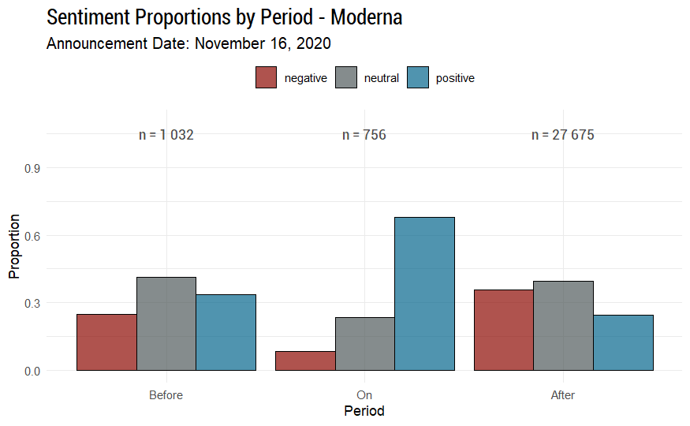
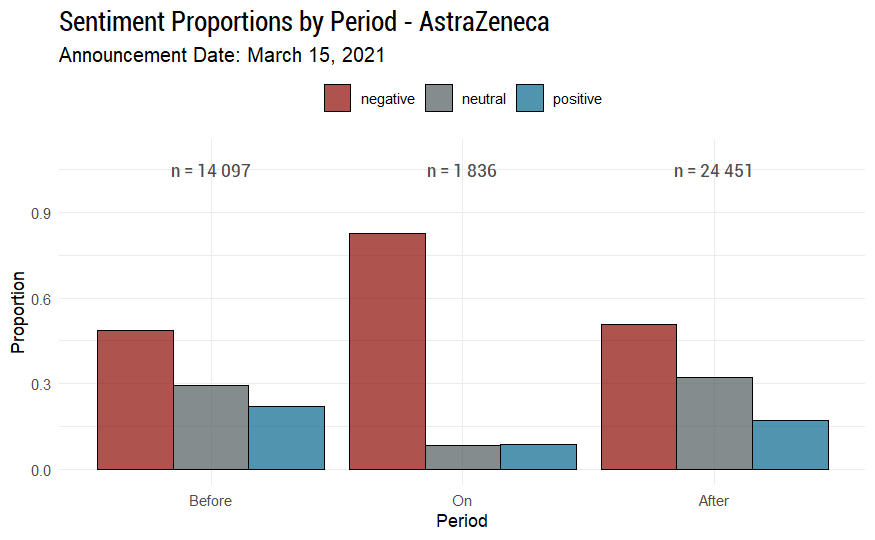

## Context During the COVID-19 Pandemic

During the COVID-19 pandemic, the global demand for a vaccine created
immense public and market pressure.

-   **Massive market potential**: global market in need of billions of doses => **high R&D costs**.\
-   **Accelerated regulatory processes**: Agencies like the **EMA** fast-tracked approval procedures to respond to the crisis.\
-   **Intense competition**: A race to develop the first vaccine to secure **first mover advantage**

## Research Problem and Objectives

**Problem:** How do mentions of vaccine side effects on French-language Twitter shape public perceptions of major pharmaceutical brands (Pfizer, AstraZeneca, Moderna) during the COVID-19 pandemic (2020-2021)?

**Objectives:**

1.  Empirically analyze how specific side effects became associated with particular brands in online discourse.

2.  Explore the mechanisms driving online risk perception and its impact on brand narratives

## Theoretical Framework

-   **Signaling theory** explains how companies use signals (like preannouncements) to reduce information asymmetry (Akerlof, 1970; Spence, 1973) and convey quality in uncertain markets.

-   **Preannouncements** serve multiple roles: informing stakeholders (investors, regulators), influencing competitors, and shaping public expectations (Eliashberg & Robertson, 1988; Robertson et al., 1995; Su & Rao, 2010).

-   **Social Amplification of Risk Framework (SARF):** This framework explains how risk perceptions are shaped and amplified (or attenuated) by social processes (Kasperson et al., 1988), especially on digital platforms ("amplification stations") (Kasperson et al., 2022).

## Hypotheses

1.  **Risk Amplification:** Public discourse on side effects will disproportionately amplify certain risks beyond their statistical frequency, aligning with SARF principles

2.  **Brand-Specific Associations:** Online conversations will construct distinct "side-effect profiles" for different brands, not necessarily mirroring clinical data but reflecting amplified narratives.

3.  **Sentiment Dynamics:** Positive announcements (e.g., high efficacy) will cause temporary positive sentiment shifts, while negative events (e.g., safety concerns, suspensions) will trigger stronger, more persistent negative sentiment, highlighting negativity bias (Baumeister et al., 2001).

## Methodology Overview

-   **Data:** Analyzed approx. 150,000 unique French-language tweets (2020-2021) mentioning Pfizer/BioNTech, Moderna, AstraZeneca, J&J, Sanofi, Valneva, filtered from a larger corpus (Banda et al., 2021). Focused on unique user content after preprocessing (removing RTs, duplicates, non-text elements).

-   **Side Effect Extraction (NER):** Used **GLiNER**, a zero-shot NER model (Zaratiana et al., 2023), fine-tuned on a small annotated set (100 tweets, F1=0.81), to identify side-effect mentions without large specific training data. Side effects were standardized into categories.

-   **Sentiment Analysis:** Used **XLM-RoBERTa** (Barbieri et al., 2021) (fine-tuned for multilingual COVID-19 tweets) to classify tweets as positive, neutral, or negative. Analyzed sentiment shifts "Before", "On", and "After" key announcement dates.

## Context Timeline

{width="110%"}

## Results: Dominant Side Effects in Discourse

Discourse heavily focused on severe, though statistically rare, events.

-   **Top Mentioned Categories:**
    1.  Thrombosis / Blood Clots (3280 mentions)
    2.  Cardiac Issues (myocarditis, etc.) (1603 mentions)
    3.  Death (474 mentions)
    4.  Neurological Issues (353 mentions)
    5.  Hemorrhages / Bleeding (305 mentions)
    

## Results: Brand Discourse Volume (Side Effects)

**Side-Effect Attention Dynamics:** The dominance of AstraZeneca and Pfizer in side-effect discussions reflects heightened public scrutiny tied to vaccine brand identity and media focus, while Moderna and Sanofi received less attention, and BioNTech remained largely invisible independently.

-   **AstraZeneca (7,660)** and **Pfizer (7,196)** dominated the discourse.

-   **Moderna (1,970)** followed significantly behind.

-   **Sanofi (1,163)** had notable volume, likely due to national visibility.

-   **BioNTech (256)** rarely appeared alone, mostly linked with Pfizer.

## Results: Brand-Specific Side Effect Associations

Distinct side-effect profiles emerged in the online conversation:

-   **AstraZeneca:** Strongly linked to thrombotic events, especially during media/regulatory scrutiny. Also linked to cutaneous reactions.

-   **Pfizer:** Associated with common reactions (fever, pain) due to wide use, but also became a focal point for broader concerns (cardiac, neurological issues) mentioned online.

-   **Moderna:** Associated with cardiac or muscle-related issues, but generally less intensely than the others.

## Results: Sentiment Dynamics (Pfizer & Moderna Efficacy)

::: latex
\begin{table}[ht]
\centering
\begin{tabular}{cc}
\textbf{Pfizer} & \textbf{Moderna} \\
\includegraphics[width=0.5\textwidth]{images/sentiment_pfizer.png} &
\includegraphics[width=0.5\textwidth]{images/sentiment_moderna.png} \\
\end{tabular}
\end{table}
:::

\tiny

::::: columns
::: {.column width="50%"}
- **Pfizer (Nov 9, 2020 - 95% Efficacy):** Positive announcement triggered a sharp sentiment shift, but effects quickly faded with a rebound in negativity.
:::

::: {.column width="50%"}
- **Moderna (Nov 16, 2020 - 94.5% Efficacy):** Positive news drove a strong but short-lived sentiment boost, followed by a rebound in negativity.
:::
:::::

<!--  -->

## Results: Sentiment Dynamics (AstraZeneca Suspension)

{width="70%"}

- **AstraZeneca (Mar 15, 2021 - Suspensions):** Negative events triggered a lasting dominance of negative sentiment, with minimal recovery.

## Discussion

- **SARF Effects:** Risk narratives amplified online, not fully aligned with clinical data

- **Signaling Issues:** Positive announcements clashed with public risk amplification 

- **Brand Reputation:** Negative events can rapidly harm brand equity, requiring transparency and engagement

- **Methodological Plus:** Fine-tuned NER with GLiNER enables scalable health discourse analysis, still rare in marketing research

## Future Research Directions

\small

- **Long-Term Trust:** Study how side-effect discussions impact brand trust over time.

- **Sentiment & Regulation:** Analyze how social media sentiment could influence regulatory actions.

- **Audience Segmentation:** Compare risk perceptions across public, HCPs, and media groups.

- **Advanced NLP:** Use LLMs for deeper sentiment, brand targeting (aspect-based), and misinformation detection.

- **Cross-Cultural Analysis:** Explore differences across countries and platforms.

## Questions

Any questions?
