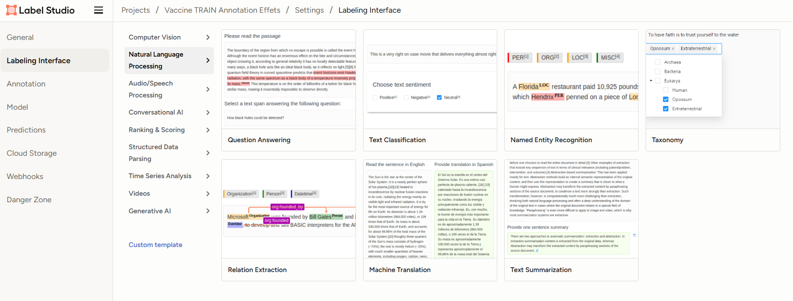
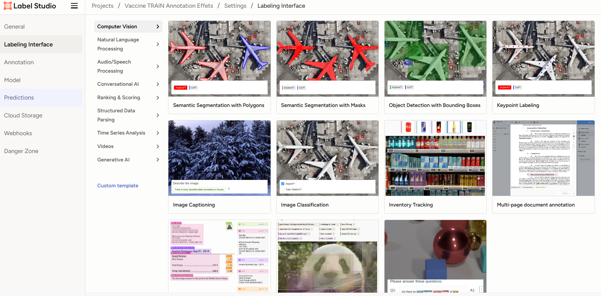
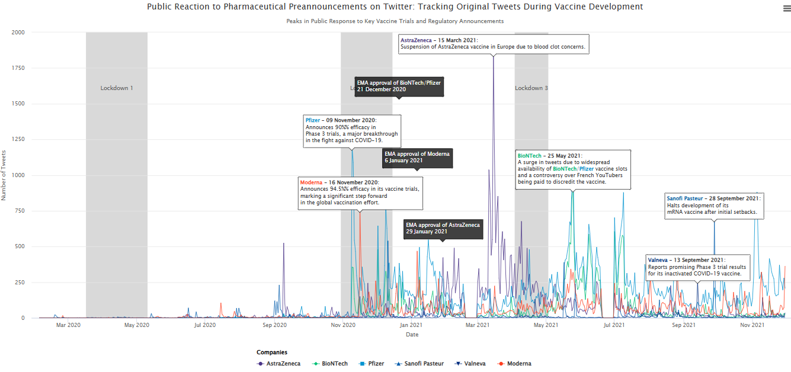
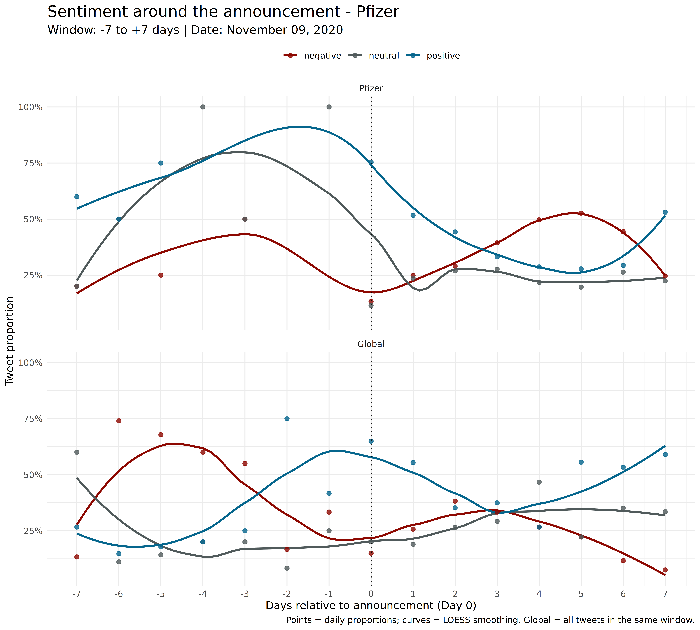
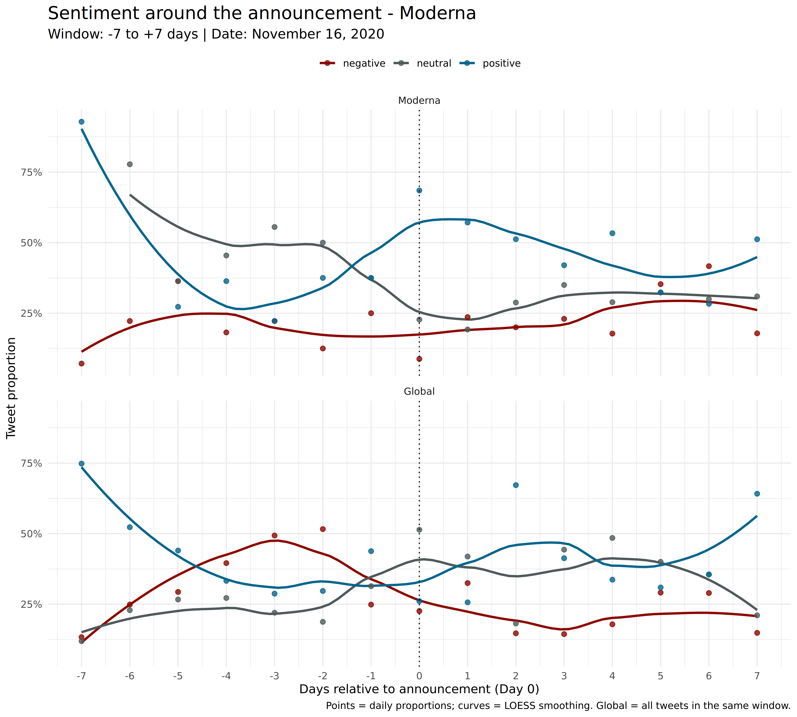
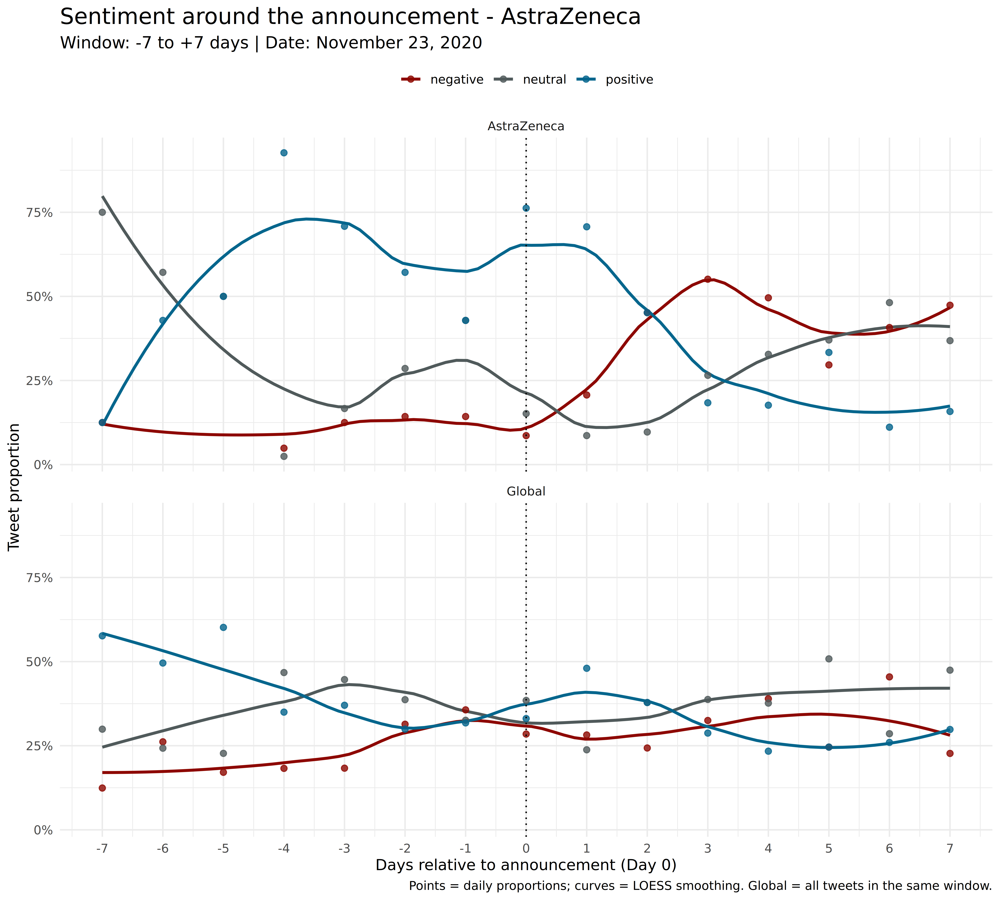

## Research Object: NPPAs as Strategic Signals

-   **NPPA** = deliberate pre-launch communication to shape expectations and market behavior (Eliashberg & Robertson, 1988; Robertson et al., 1995; Su & Rao, 2010).
-   **Signaling theory**: firms use signals to reduce information asymmetry in uncertain markets (Akerlof, 1970; Spence, 1973).
-   In pharmaceuticals, signals target investors, regulators, competitors, health professionals, and the public.

------------- 

## Strategic Benefits vs. Reputational Risk

-   **Benefits:** reassure stakeholders, deter competitors, and frame innovation before launch.
-   **Risks:** once public, messages can be reframed by audiences, shifting attention toward safety concerns and controversies.
-   Early communication is a strategic trade-off rather than a purely positive signal.

------------- 

## Social Amplification of Risk (SARF)

-   SARF explains how risk perceptions are transformed by social processes, not only by technical facts (Kasperson et al., 1988).
-   Digital platforms act as **amplification stations**, which can amplify or attenuate perceived risk (Kasperson et al., 2022).
-   SARF frames amplification/attenuation as a two-stage process: initial signal transfer and subsequent societal responses (behavioral, economic, symbolic) (Hopfer et al., 2025).
-   Early amplification is shaped by information volume, ambiguity/dispute, dramatization, and symbolic cues (Hopfer et al., 2025).
-   This creates a tension between **controlled signals** and **emergent public narratives**.

------------- 

## Why COVID-19 Is a Stress Test

During the COVID-19 pandemic, the global demand for a vaccine created
immense public and market pressure.

-   **Massive market potential**: global market in need of billions of doses => **high R&D costs**.\
-   **Accelerated regulatory processes**: Agencies like the **EMA** fast-tracked approval procedures to respond to the crisis.\
-   **Intense competition**: A race to develop the first vaccine to secure **first mover advantage**

------------- 

## Research Questions

\small

| Research question | What is measured? | Operationalization (data + methods) |
| --- | --- | --- |
| **RQ1 / H1 (structure): Who are the amplification stations / opinion leaders?** | *Who amplifies whom* in the COVID/vaccine issue arena | **Retweet network** (directed, weighted): nodes = accounts; edge *u -> v* if *u* retweets *v* (weight = count). |
| **RQ2 / H2 (social reaction): How do Twitter users react to NPPAs?** | Cognitive / emotional responses around announcements | Sentiment/emotion analysis in NPPA event windows |
| **RQ3 / H3 (risk amplification): How is risk-related content amplified?** | Salience of side effects and brand associations vs clinical signals | Adverse-event extraction; side-effect categories; brand-specific associations; comparison with official signals (SARF gap). |


------------- 

## Methodology Overview

-   **Data:** Full corpus of 50.4M French tweets (2020-2021; Banda et al., 2021). Retweet network uses the full corpus; content analyses use ~150,000 unique vaccine-brand tweets after filtering and removing RTs/duplicates.

-   **Side Effect Extraction (NER):** Used **GLiNER**, a zero-shot NER model (Zaratiana et al., 2023), fine-tuned on a small annotated set (100 tweets, F1=0.81), to identify side-effect mentions without large specific training data. Side effects were standardized into categories.

-   **Sentiment Analysis:** Used **XLM-RoBERTa** (Barbieri et al., 2021) (fine-tuned for multilingual COVID-19 tweets) to classify tweets as positive, neutral, or negative. Analyzed sentiment shifts "Before", "On", and "After" key announcement dates.


## Dataset Overview (Full Corpus)

\scriptsize

| metric | value |
| --- | ---: |
| Tweets (N) | 50,376,815 |
| Unique users | 3,022,144 |
| Date range | 2020-01-29 to 2021-11-30 |
| Verified share (tweets) | 1.6% |
| Retweets (share) | 72.3% |
| Originals (share) | 11.8% |
| Replies (share) | 8.1% |
| Quotes (share) | 7.9% |
| Median retweets | 37 |
| Median likes | 77 |
| Mean retweets (p99.9 cap) | 1107.1 |
| Mean likes (p99.9 cap) | 3809.1 |
| Avg words | 25.8 |
| Avg chars | 157.2 |
| Avg hashtags | 0.79 |
| Avg mentions | 0.43 |
| Avg URLs | 0.77 |

\tiny

- Means capped at the 99.9th percentile to reduce extreme outliers.

\normalsize

## Methodology - Retweet Network Construction

-   **Graph:** Directed, weighted; edge u -> v if u retweets v (weight = retweet count).
-   **Scale:** 502,565 accounts; GCC (giant connected component) = 475,924 (94.7%) with 3.4M directed edges.
-   **Amplification score:** z-score average of weighted indegree + PageRank + k-core (proxy for amplification stations).
-   **Diffusion score:** z-score of weighted outdegree (proxy for active relays).


## Methodology - NER with Label Studio

Start Label Studio with:
``` shell
label-studio start
```


## Label Studio interface



## Finetuning - Labelling data


## Finetuning - Upload annotated data

We used the [GliNER Studio Colab notebook](https://colab.research.google.com/drive/1rPmi_rdvVbVLHkuR56iuZU7YMLFYRGPA) from [Knowledgator](https://www.linkedin.com/company/knowledgator/).


## Finetuning - Train the model


## RQ1 - Results: Retweet Network Topology

\scriptsize

| metric | value | interpretation |
| --- | ---: | --- |
| n_nodes | 502,565 | Total unique accounts (nodes). |
| n_gcc | 475,924 | Accounts in the giant connected component (GCC). |
| gcc_pct | 94.70 | Share of nodes in the GCC (main connected core). |
| gcc_edges_directed | 3,415,352 | Directed ties in the GCC (A->B retweet link). |
| gcc_edges_undirected | 3,385,853 | Same ties ignoring direction ({A,B}). |
| density_directed | 0.00001508 | Directed density: observed / possible ties (very sparse). |
| density_undirected | 0.00002990 | Undirected density: observed / possible links (very sparse). |

\scriptsize

- The network is **massive** yet **extremely sparse**, with a **dominant giant component**: most accounts are connected through retweet paths.
- This architecture is consistent with **centralized amplification**, where visibility concentrates around a limited set of stations.


## RQ1 - Results: Amplification Stations (Composite Score, Top 10)

\small

| account | amplification_score |
| --- | ---: |
| Mediavenir | 327.766954 |
| f_philippot | 106.112639 |
| MediavenirGN | 99.256252 |
| FocusFR_ | 84.167662 |
| LPLdirect | 53.739009 |
| franceinfo | 51.262677 |
| GaumontRene | 49.303869 |
| ConflitsFrance | 48.679994 |
| BFMTV | 47.629672 |
| ActuFoot_ | 45.797989 |

\tiny

- The composite score captures **robust stations** that remain top-ranked across **volume (attention)** and **structure (centrality/core)**.
- Dominant station types include **media**, **political figures**, and **health professionals** (bio-based inference).


## RQ1 - Results: Different Network Roles (Sources vs Relays)

\scriptsize

::::: columns
::: {.column width="50%"}
**Source-like stations (HITS authorities, Top 10)**  
(retweeted by strong hubs)

| account | authority |
| --- | ---: |
| Mediavenir | 0.951057 |
| ConflitsFrance | 0.149024 |
| BFMTV | 0.122332 |
| f_philippot | 0.091110 |
| le_Parisien | 0.070293 |
| franceinfo | 0.055892 |
| Laissonslespre1 | 0.049848 |
| morandiniblog | 0.048183 |
| DIVIZIO1 | 0.046031 |
| LPLdirect | 0.045813 |
:::

::: {.column width="50%"}
**High-activity relays (diffusion_score, Top 10)**  
(propagation channels; heavy retweeters)

| account | diffusion_score |
| --- | ---: |
| viralvideovlogs | 131.296391 |
| julien0686 | 103.110291 |
| menuet_morgan | 90.673560 |
| William85837998 | 67.635671 |
| vicmahec | 67.356033 |
| radiolondres6 | 64.896651 |
| chriss17031 | 64.559651 |
| NC4415 | 64.032640 |
| languillem | 61.716662 |
| lagrostA | 55.087802 |
:::
:::::

\tiny

- The network separates **attention sources** (authorities) from **propagation engines** (relays).
- This distinction matters for RQ2/RQ3: sources can shape *what* becomes salient, while relays shape *how far / how fast* it travels.

## Context Timeline (NPPA Windows)

{width="110%"}

## RQ2 - Results: Sentiment Dynamics (Pfizer Efficacy)

{width="85%" fig-align="center"}

## RQ2 - Results: Sentiment Dynamics (Moderna Efficacy)

{width="85%" fig-align="center"}

## RQ2 - Results: Sentiment Dynamics (AstraZeneca Suspension)

{width="85%" fig-align="center"}

## RQ3 - Results: Dominant Side Effects in Discourse

\scriptsize

Discourse heavily focused on severe events. SARF analysis reveals a massive disconnect in frequency perception.

| Mentioned Category | Volume | Clinical Reality (Official Guidelines) | SARF Gap |
|:---|:---:|:---|:---|
| **1. Thrombosis** | **3,280** | **Very rare (<1/10,000):** TTS (AstraZeneca). | **Extreme amplification** |
| **2. Cardiac Issues** | **1,603** | **Very rare (<1/10,000):** Myocarditis (Pfizer/Moderna). | **High amplification** |
| **3. Death** | **474** | **Not listed** in safety profiles. | **Fabrication** |
| **4. Neurological** | **353** | **Seizures not listed;** facial paralysis rare. | **Distortion** |
| **5. Hemorrhages** | **305** | **Not listed;** menstrual issues monitored. | **Uncertainty gap** |

## RQ3 - Results: Dominant Side Effects in Discourse (Interpretation)

\small

- These are **tweet mentions**, not clinical incidence rates.
- **Thrombosis** and **cardiac issues** dominate despite being clinically very rare - classic SARF amplification.
- **Death** appears as a salient symbol, even when absent from formal safety profiles.
- **Neurological** focus emphasizes unlisted or ambiguous symptoms, widening the perception gap.
- **Hemorrhages** illustrate uncertainty: monitored signals become salient without frequency tables.

## RQ3 - Results: Brand Discourse Volume (Side Effects)

\scriptsize

**Side-Effect Attention Dynamics:** The dominance of AstraZeneca and Pfizer reflects heightened public scrutiny tied to brand identity.

:::: {.columns}

::: {.column width="60%"}
**Social Discourse**

- **AstraZeneca (7,660)** and **Pfizer (7,196)** dominated the discourse.
- **Moderna (1,970)** followed significantly behind.
- **Sanofi (1,163)** had notable volume.
- **BioNTech (256)** rarely appeared alone.
:::

::: {.column width="40%"}
**Clinical Reality (Context)**

- **AstraZeneca:** Only **~7.8M** injections.
    - *Paradox:* Highest noise for lowest usage.
- **Pfizer:** **~123.5M** injections.
    - *Context:* High volume proportional to massive use.
- **Moderna:** **~24.2M** injections.
- **Sanofi:** **~6,900** injections.
    - *Note:* Discourse volume is disconnected from clinical reality.
:::

::::

## RQ3 - Results: Brand-Specific Side Effect Associations

\scriptsize

Distinct side-effect profiles emerged. Comparison with Official Safety Profiles (ANSM):

- **AstraZeneca**
    - *Discourse:* Strongly linked to thrombotic events.
    - *Official Profile:* **TTS** listed as **"Very Rare (<1/10,000)"**.
    - *SARF Verdict:* **Rational but Disproportionate.** The risk exists but became the sole identity of the brand despite its extreme rarity.

- **Pfizer**
    - *Discourse:* Focal point for broad concerns (cardiac, neurological, fertility).
    - *Official Profile:* **Myocarditis** is **"Very Rare"**. **Seizures** are **Absent** from the adverse reaction table.
    - *SARF Verdict:* **Distortion.** Social discourse invented frequency (making rare events seem common) and symptoms (seizures).

- **Moderna**
    - *Discourse:* Associated with cardiac issues.
    - *Official Profile:* **Myocarditis** listed as **"Very Rare (<1/10,000)"**.
    - *SARF Verdict:* **Alignment.** Discourse reflects the specific regulatory warning.

## Discussion

- **SARF Effects:** Risk narratives amplified online, not fully aligned with clinical data

- **Signaling Issues:** Positive announcements clashed with public risk amplification 

- **Brand Reputation:** Negative events can rapidly harm brand equity, requiring transparency and engagement


## Questions

Any questions?
