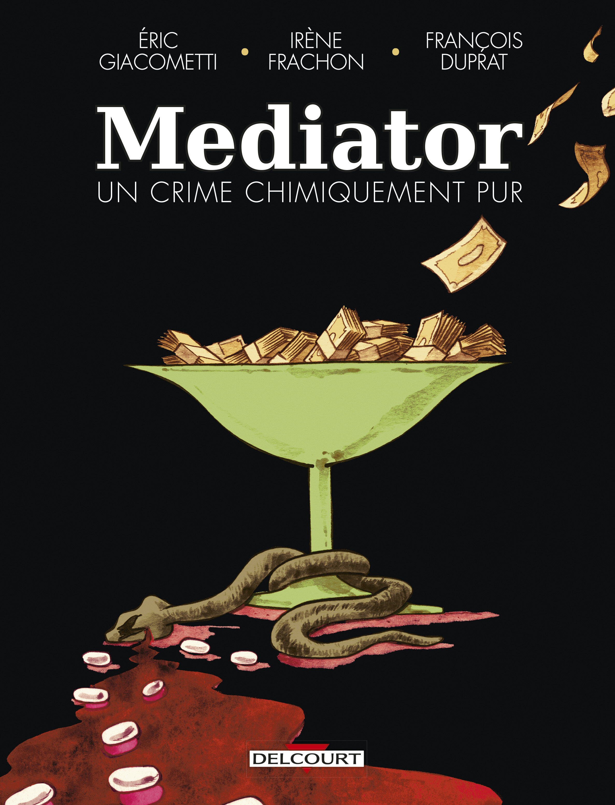
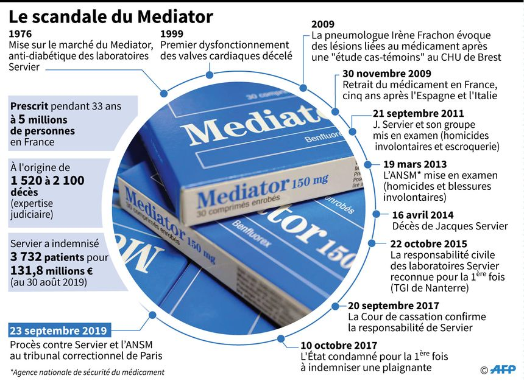
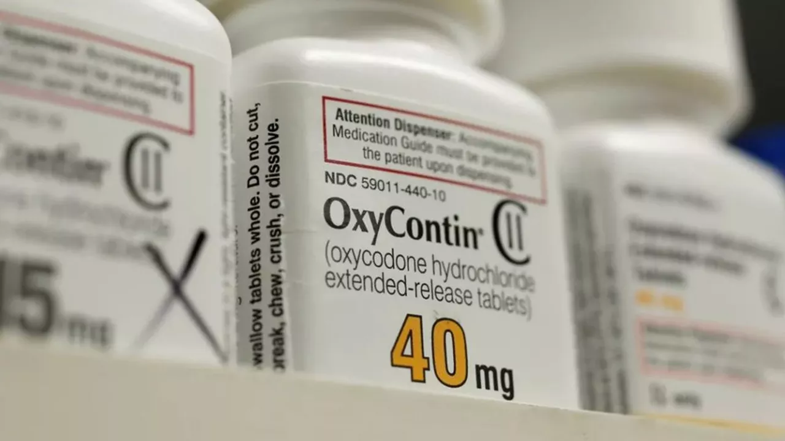
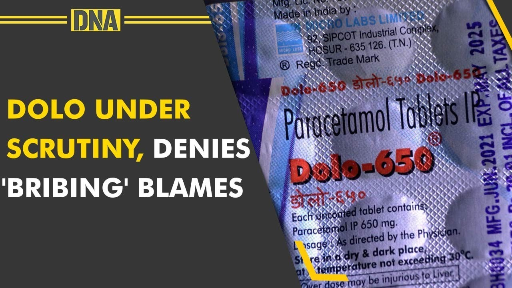
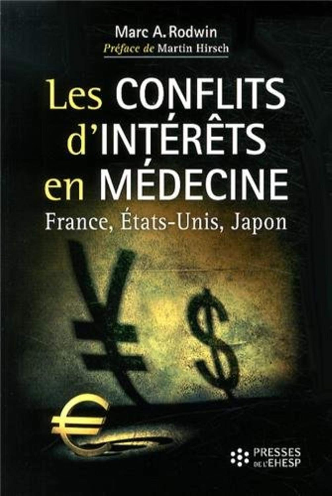
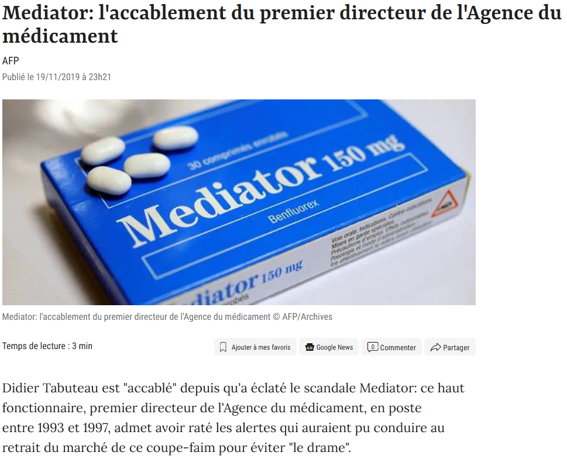
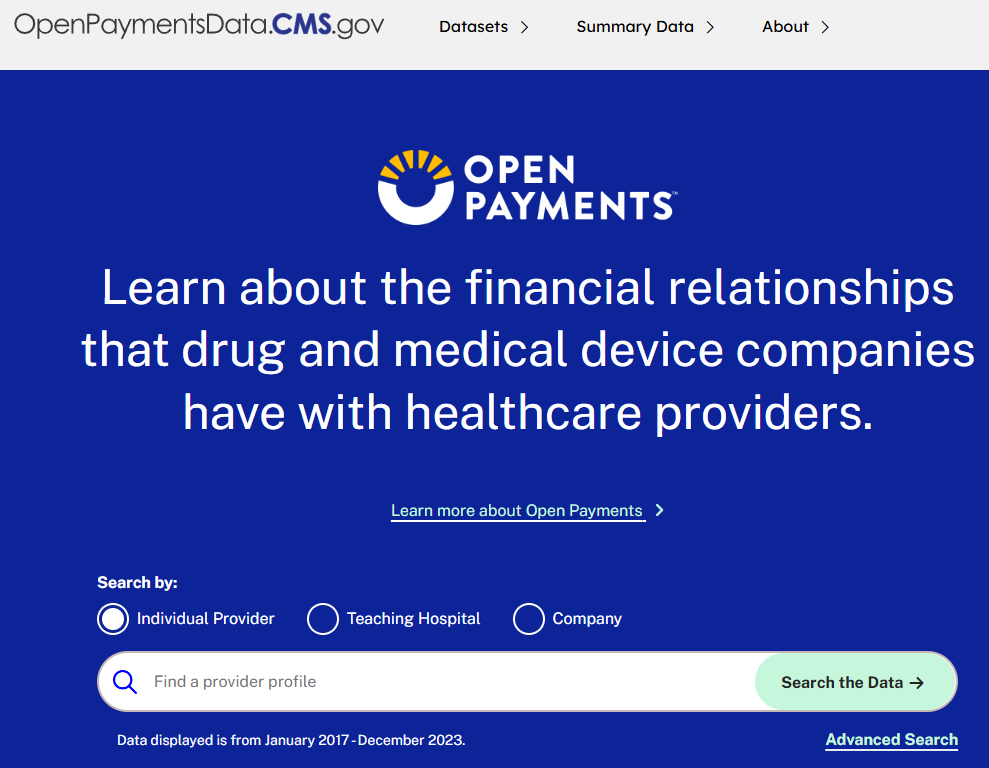
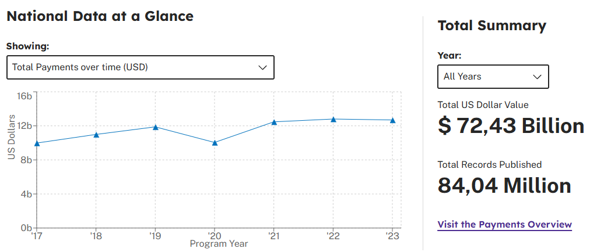

## France : Mediator - Servier

::::: columns
::: {.column width="40%"}
{width="100%"}
:::

::: {.column width="60%"}
{width="100%"}
:::
:::::

```{=html}
<!--

Scandale du Mediator : le laboratoire Servier a promu un médicament dangereux, largement prescrit hors AMM, en influençant experts et autorités sanitaires. Cette affaire a révélé de graves conflits d’intérêts et un manque de transparence dans la régulation du médicament en France. Elle a conduit à la création du dispositif Transparence Santé et au renforcement des lois anti-cadeaux.

-->
```

------------------------------------------------------------------------

## Etats-Unis : Opioides - Purdue Pharma

::::: columns
::: {.column width="60%"}
{width="100%"}
:::

::: {.column width="60%"}
{width="100%"}
:::
:::::

```{=html}
<!--

Crise des opioïdes : des laboratoires comme Purdue Pharma ont promu de puissants antidouleurs en minimisant leurs risques d’addiction, avec l’aide de médecins influencés par des paiements massifs. Ce scandale illustre l’échec d’un modèle centré uniquement sur la divulgation tardive des liens financiers. Il a conduit à la création du Sunshine Act et d’Open Payments, sans interdire les paiements.

-->
```

------------------------------------------------------------------------

## Inde : Dolo-650 - Micro Labs

::::: columns
::: {.column width="50%"}
{width="100%"}
:::

::: {.column width="50%"}
{width="100%"}
:::
:::::

```{=html}
<!--

Scandale du Dolo-650 : le fabricant Micro Labs est accusé d’avoir massivement offert des cadeaux et avantages aux médecins pour stimuler la prescription de paracétamol, en dehors de tout cadre public de transparence. L’affaire a révélé les faiblesses d’un système d’autorégulation volontaire sans base de données ni sanction. Elle a conduit au renforcement du code UCPMP en 2024.

-->
```

------------------------------------------------------------------------

## Du scandale à la prise de conscience réglementaire ?

\scriptsize

+----------------+---------------------------------------------------------+---------------------------------------------------------------------------------------------------------+----------------------------------------------------------------------------------------------------------------------------------------------+
| **Pays**       | **Scandale**                                            | **Nature du problème**                                                                                  | **Réaction réglementaire**                                                                                                                   |
+================+=========================================================+=========================================================================================================+==============================================================================================================================================+
| **France**     | Mediator (Servier, **1976**, retiré du marché en 2009)  | Prescription massive hors AMM d’un coupe-faim toxique.<br> Influence des experts, opacité totale.       | Loi Bertrand (2011) : transparence obligatoire via la base **Transparence Santé** ;<br> interdiction des avantages ; <br> réforme de l’ANSM. |
+----------------+---------------------------------------------------------+---------------------------------------------------------------------------------------------------------+----------------------------------------------------------------------------------------------------------------------------------------------+
| **États-Unis** | Crise des opioïdes – Purdue Pharma OxyContin (**1996**) | Marketing mensonger de l’OxyContin présenté comme non addictif.<br> Surprescription, dépendance, décès. | Sunshine Act (2010) : base **Open Payments** ;<br> divulgation publique des liens ;<br> poursuites judiciaires.                              |
+----------------+---------------------------------------------------------+---------------------------------------------------------------------------------------------------------+----------------------------------------------------------------------------------------------------------------------------------------------+
| <br>**Inde**   | Dolo-650 – Micro Labs (**2020**)                        | Cadeaux massifs aux médecins pour stimuler les prescriptions.<br> Absence de contrôle public.           | Code UCPMP 2024 : tentative d’autorégulation contraignante ;<br> interdiction des cadeaux, sans base publique claire.                        |
+----------------+---------------------------------------------------------+---------------------------------------------------------------------------------------------------------+----------------------------------------------------------------------------------------------------------------------------------------------+

```{=html}
<!--

UCPMP ça veut dire : Uniform Code for Pharmaceutical Marketing Practices

Références intéressantes :

Série Dopesick (2021) à propos du scandale de l'Oxycontin aux USA. On voit comment Purdue Pharma a manipulé les médecins et les agences de santé pour promouvoir son médicament, malgré les risques d'addiction. La série montre aussi les conséquences tragiques de cette crise sur la santé publique.
Série "The Pharmacist" (2020) de Daniel Junge. Ce documentaire suit un pharmacien de Louisiane qui se bat contre Purdue Pharma et l'épidémie d'opioïdes aux États-Unis. Il met en lumière les effets dévastateurs de la crise sur les communautés locales.
Film "The Crime of the Century" (2021) de Alex Gibney. Ce documentaire explore la crise des opioïdes aux États-Unis, en mettant en lumière le rôle de Purdue Pharma et d'autres acteurs de l'industrie pharmaceutique dans la promotion de médicaments addictifs.

Film "Toute la beauté et le sang versé" (2022) de Laura Poitras. Le film a pour sujet la vie et l'œuvre de la photographe Nan Goldin, ainsi que son combat contre la famille Sackler, propriétaire de la société pharmaceutique Purdue Pharma impliquée dans la crise des opioïdes avec son produit l'OxyContin (wiki).

Série Painkiller (2023) sur Netflix. La série raconte l'histoire de Purdue Pharma et de la crise des opioïdes aux États-Unis, en mettant en lumière les pratiques douteuses de l'entreprise et les conséquences tragiques de la surprescription d'analgésiques opioïdes.


-->
```

## Problématique

::: callout-important
## Problématique

**Comment les États régulent-ils les conflits d’intérêts entre les professionnels de santé et l'industrie pharmaceutique, et quels modèles de transparence et de contrôle produisent-ils ?**
:::

## Conflit d'intérêts : quelle définition ?

\small

-   Un **conflit d’intérêts (CI)** est une situation dans laquelle deux ou plusieurs intérêts contradictoires affectent une personne et/ou une organisation. Il ne s’agit pas d’une action inappropriée en soi, mais d’un "état d’être", qui peut ne pas être conscientisé. [@abraham2010]

-   Il est donc important de distinguer l’état de conflit d’intérêts du comportement réel : comme le souligne @sismondo2008, le terme peut être trompeur, car il suggère à tort qu’une personne en situation de conflit d’intérêts agira nécessairement de manière biaisée.

-   Les **formes d’influence** peuvent être subtiles : les "cadeaux", les hospitalités, les contrats de consultant, de recherche, de conférencier créent des liens de réciprocité implicites qui peuvent influencer les décisions et les attitudes des experts envers les entreprises/produits ,etc. [@sismondo2008; @katz2010]

```{=html}
<!--

Par exemple, un expert conseillant une agence de réglementation des médicaments peut être en conflit d'intérêts s'il promeut simultanément les intérêts commerciaux d'entreprises pharmaceutiques tout en conseillant le gouvernement sur une réglementation qui pourrait nuire à ces intérêts commerciaux, alors que l'obligation légale du gouvernement est de protéger la santé publique. Il est donc important de distinguer théoriquement le fait d'être dans un état de conflit d'intérêts de la manière dont l'individu ou l'institution agit en conséquence de cet état3. Le fait d'être en situation de CI ne signifie pas nécessairement que le chercheur, le scientifique ou l'expert agira de manière inappropriée.

-->
```

## Quels cadres théoriques pour analyser ces relations ?

-   **Capture réglementaire** [@stigler1984]

    -   Les régulations censées protéger l’intérêt général peuvent être détournées par les acteurs régulés. L’industrie influence les autorités via le lobbying, l’expertise ou les revolving doors, pour orienter les règles en sa faveur. (conflits d’intérêts tolérés, autorégulation de façade, sanctions faibles)

-   **Transparence et gouvernementalité** [@foucault2011; @fung2007; @meijer2018]

    -   La transparence fonctionne comme une technique de gouvernementalité : en exposant les comportements, elle incite à l’auto-discipline sans contrainte directe.
    -   Elle vise à renforcer la responsabilité (accountability) des médecins (regard des pairs, patients, autorités), mais reste inefficace si l’information est illisible ou inutilisée.

## Des cadres politiques et institutionnels variés – **France** [@rodwin2014]

::::: columns
::: {.column width="20%"}
{width="120%"}
:::

\footnotesize

::: {.column width="80%"}
-   **Forte autorégulation** par le corps médical (Ordre, syndicats), qui freine historiquement l’intervention de l’État dans la régulation des pratiques libérales.

-   L’État reste toutefois présent via un **puissant secteur hospitalier public**. Les liens entre médecins et industrie sont **encadrés mais persistent**.

-   Comme le rappelle le Conseil constitutionnel [@tabuteau2023libertes], le système de santé français s’est construit sur des **libertés médicales étendues** :

    -   liberté d’installation,
    -   liberté de prescription,
    -   liberté de tarification,
    -   perçues historiquement comme des garanties de l’indépendance professionnelle.

-   Toutefois, ces libertés font aujourd’hui l’objet d’un **encadrement progressif**, justifié par des objectifs de santé publique et d’égal accès aux soins.
:::
:::::

## Réflexion sur les libertés médicales… par un ancien régulateur

:::::: columns
::: {.column width="33%"}
{width="100%"}
:::

::: {.column width="33%"}
{width="100%"}
:::

::: {.column width="33%"}
{width="100%"}
:::
::::::

## Une régulation française sous contrainte européenne

\small

-   La régulation du médicament en France est également structurée par le cadre européen, qui impose des normes communes à l’ensemble des États membres :/

    -   L’**Agence européenne des médicaments (EMA)** délivre les **AMM** pour les médicaments innovants dans toute l’Union européenne, centralisant ainsi une partie de la décision réglementaire.

    -   Le **règlement 536/2014** impose la **publication des essais cliniques** via le **Clinical Trials Information System (CTIS)**, renforçant la transparence des données scientifiques utilisées pour les AMM.

    -   L’Union européenne encadre également les **conflits d’intérêts dans les agences** (EMA, EFSA…), notamment depuis les critiques formulées après les crises sanitaires liées à la grippe H1N1 et à l’affaire Mediator.

    -   La **Direction générale de la concurrence (DG COMP)** a mené plusieurs enquêtes sur les **pratiques anticoncurrentielles de l’industrie pharmaceutique** (ex. stratégies de type *pay for delay*), ce qui a produit un **effet régulateur indirect**, en incitant les entreprises à plus de conformité.

```{=html}
<!--

Les stratégies dites de *pay for delay* illustrent une **forme de conflit d’intérêts inter-entreprises** : une entreprise pharmaceutique titulaire d’un brevet (médicament "princeps" apparemment) paie un fabricant de génériques pour **retarder l’entrée d’un médicament concurrent** sur le marché. Bien que ces accords soient privés, ils ont des **conséquences publiques majeures**, en **prolongeant artificiellement des monopoles** au détriment des patients et des systèmes de santé.

Ces pratiques révèlent un **biais systémique** dans la régulation du médicament, où **les autorités sanitaires peuvent être contournées** par des accords commerciaux opaques. Elles montrent que la régulation du secteur ne peut pas se limiter à la relation industrie–professionnels de santé, mais doit aussi intégrer une **vigilance sur les conflits d’intérêts entre entreprises**.

**Exemples marquants** :
- **Servier – Périndopril (UE)** : l’entreprise a versé des paiements à des fabricants de génériques pour retarder l’entrée sur le marché de leur version du médicament. L’UE a infligé une amende de 427 millions € (CJUE, 2022).
- **AbbVie – Teva (USA)** : paiement pour retarder un générique de l’AndroGel. Poursuivi par la FTC pour entente anticoncurrentielle.
- **Actavis – Provigil (USA)** : plus de 200 M$ versés à des concurrents pour repousser la sortie du modafinil générique.

Ces affaires rappellent l’importance de croiser **régulation sanitaire** et **régulation de la concurrence**, afin de préserver un accès équitable et transparent aux médicaments.

-->
```

-   Ainsi, la régulation nationale française s’inscrit dans un **cadre multi-niveaux**, où les normes européennes jouent un rôle essentiel dans la définition des contraintes et des marges d’action des autorités sanitaires nationales.

## Des cadres politiques et institutionnels variés – **États-Unis** [@rodwin2014]

-   **Logique de marché dominante** dans l’organisation des soins.
-   L’**American Medical Association (AMA)** a longtemps défendu l’autonomie des médecins contre toute régulation externe.
-   Le **secteur privé** joue un rôle croissant dans la régulation des pratiques médicales, notamment :
    -   les assureurs,
    -   les organisations de soins intégrés (Health Maintenance Organizations = HMO),
-   Cette régulation privée se fait **parfois au détriment de l’intérêt clinique**.
-   Le **pouvoir public reste relativement faible** dans ce domaine.

## Des cadres politiques et institutionnels variés – **Inde** [@bhat1996; @mudur2004; @baru2013]

\small

-   **Essor rapide du secteur privé** dans un contexte de régulation **faible et morcelée**.
-   Plusieurs lois existent :
    -   *Medical Council Act*,
    -   *Consumer Protection Act*, etc., mais leur mise en œuvre est **largement déficiente**.
-   La *National Medical Commission* (créée en 2019) a remplacé un Conseil médical **entaché de corruption**, sans changement structurel majeur.
-   Les **conflits d’intérêts** restent omniprésents dans :
    -   la formation médicale,
    -   la prescription,
    -   les essais cliniques.
-   La faiblesse des inspections, **absence de transparence publique**, et influence persistante des **lobbys médicaux** rendent la régulation largement **inefficace**, malgré la croissance du secteur.

```{=html}
<!--
Le cas des États-Unis illustre particulièrement bien la tension entre logique de marché et intérêt clinique dans la régulation des pratiques médicales. Le système repose largement sur des acteurs privés comme les assureurs ou les HMO (Health Maintenance Organizations), qui fixent les conditions de prise en charge des soins. Cette configuration produit une forme de « gouvernement par les payeurs », où les décisions médicales sont souvent encadrées, voire contraintes, par des critères économiques.

Cela soulève une question centrale de conflit d’intérêts structurel : lorsque les entreprises de santé ou les assureurs influencent les choix cliniques via des incitations financières, des restrictions de remboursement ou des guides de pratique, ils peuvent orienter la médecine dans un sens qui ne correspond pas toujours à l’intérêt du patient. Par exemple, un médecin intégré dans une HMO peut être dissuadé de prescrire certains traitements coûteux, même s’ils sont cliniquement indiqués.

Cette forme d’influence indirecte, mais systémique, montre que le conflit d’intérêts ne se limite pas à des paiements visibles ou individuels, mais peut être intégré aux mécanismes mêmes du système de soins. Cela appelle à une régulation qui ne se contente pas de rendre publics les liens d’intérêts, mais interroge aussi les logiques économiques qui gouvernent les décisions médicales.
-->
```

## Réglementations et dispositifs de transparence

\tiny

+--------------------------+-----------------------------------------------------------------------------------------------------+--------------------------------------------------------------------------------------+----------------------------------------------------------------------------------------+
|                          | **France**                                                                                          | **États-Unis**                                                                       | **Inde**                                                                               |
+==========================+=====================================================================================================+======================================================================================+========================================================================================+
| **Nature du dispositif** | Transparence + interdiction partielle des cadeaux                                                   | Transparence uniquement (déclaration publique)                                       | Code déontologique sans transparence publique (UCPMP)                                  |
+--------------------------+-----------------------------------------------------------------------------------------------------+--------------------------------------------------------------------------------------+----------------------------------------------------------------------------------------+
| **Base légale**          | Loi Bertrand (2011), loi anti-cadeaux (1993, réformée en 2017, appliquée en 2020)                   | ACA, Sec. 6002 (2010, Physician Payments Sunshine Act)                               | Directive du Department of Pharmaceuticals (pas de loi formelle)                       |
+--------------------------+-----------------------------------------------------------------------------------------------------+--------------------------------------------------------------------------------------+----------------------------------------------------------------------------------------+
| **Champ d’application**  | Entreprises de santé + tous les bénéficiaires (professionnels, étudiants, associations)             | Fabricants + médecins, hôpitaux et désormais assistants médicaux (Medicare/Medicaid) | Entreprises adhérentes + tous pros de santé (public & privé)                           |
+--------------------------+-----------------------------------------------------------------------------------------------------+--------------------------------------------------------------------------------------+----------------------------------------------------------------------------------------+
| **Obligations**          | Déclaration semestrielle \>10 € (Transparence Santé) ; contrats notifiés au CNOM (mais pas publiés) | Déclaration annuelle \>\$10 ou \>\$100/an (Open Payments)                            | Registres internes ; mécanisme de plainte ; pas de base publique                       |
+--------------------------+-----------------------------------------------------------------------------------------------------+--------------------------------------------------------------------------------------+----------------------------------------------------------------------------------------+
| **Interdictions**        | Cadeaux interdits sauf exceptions (recherche, congrès) ; hospitalité encadrée                       | Aucune interdiction générale ; sanctions possibles via lois anti-corruption          | Cadeaux et sponsoring interdits, mais sans seuil national clair                        |
+--------------------------+-----------------------------------------------------------------------------------------------------+--------------------------------------------------------------------------------------+----------------------------------------------------------------------------------------+
| **Contrôle**             | Ministère de la Santé (publication), CNOM (déontologie), DGCCRF/Justice (sanctions)                 | CMS (collecte), Department of Justice & HHS-OIG (fraude, sanctions)                  | Department of Pharmaceuticals (code), comités d’éthique industriels, NMC (déontologie) |
+--------------------------+-----------------------------------------------------------------------------------------------------+--------------------------------------------------------------------------------------+----------------------------------------------------------------------------------------+

## Transparence : les outils en France [@codeem2023]

\begin{tabular}{cc}
\includegraphics[width=0.45\linewidth]{images/clipboard-4090671918.png} &
\includegraphics[width=0.45\linewidth]{images/clipboard-3072686212-01.png} \\
\includegraphics[width=0.45\linewidth]{images/clipboard-3436987879.png} &
\includegraphics[width=0.45\linewidth]{images/clipboard-1385557922.png} \\
\end{tabular}

## Transparence : les outils aux Etats-Unis

::::: columns
::: {.column width="50%"}

:::

::: {.column width="50%"}

:::
:::::

## Limites des dispositifs de transparence 1/2

\tiny

+--------------------------+------------------------------------------------------------------------------------------------------------------------------------------------------------------------------------------------------------------------------------+--------------------------------------------------------------------------------------------------------------------------------------------------------------------------------------------------------------------------------------------------------+------------------------------------------------------------------------------------------------------------------------------------------------------------------------------------------------------------------+
|                          | **France**                                                                                                                                                                                                                         | **États-Unis**                                                                                                                                                                                                                                         | **Inde**                                                                                                                                                                                                         |
+==========================+====================================================================================================================================================================================================================================+========================================================================================================================================================================================================================================================+==================================================================================================================================================================================================================+
| **Type de transparence** | Base publique Transparence Santé (2014)                                                                                                                                                                                            | Open Payments (2014)                                                                                                                                                                                                                                   | Code UCPMP 2024 : code d’autorégulation sans force légale, publié par le Department of Pharmaceuticals [@chaliha2024; @nishithdesai2025]                                                                         |
+--------------------------+------------------------------------------------------------------------------------------------------------------------------------------------------------------------------------------------------------------------------------+--------------------------------------------------------------------------------------------------------------------------------------------------------------------------------------------------------------------------------------------------------+------------------------------------------------------------------------------------------------------------------------------------------------------------------------------------------------------------------+
| **Problèmes soulevés**   | Base jugée plus accessible que d’autres en Europe mais avec des données peu lisibles avec une qualité variable. L’absence d’identifiants uniques et une sous-déclaration liée au consentement des bénéficiaires [@ozieranski2021]\ | Faible usage par les patients. Biais d’auto-déclaration. Effets pervers possibles [@chao2020; @kanter2019]                                                                                                                                             | Absence de base publique de divulgation. Dépenses publiées sur les sites des entreprises uniquement. Transparence partielle sans vérification centralisée ni audit indépendant [@chaliha2024; @nishithdesai2025] |
|                          | Données peu fiables avant 2020, refonte technique (2022).                                                                                                                                                                          |                                                                                                                                                                                                                                                        |                                                                                                                                                                                                                  |
+--------------------------+------------------------------------------------------------------------------------------------------------------------------------------------------------------------------------------------------------------------------------+--------------------------------------------------------------------------------------------------------------------------------------------------------------------------------------------------------------------------------------------------------+------------------------------------------------------------------------------------------------------------------------------------------------------------------------------------------------------------------+
| **Effets mesurés**       | Impact incertain sur les comportements individuels mais forte utilisation par les journalistes les ONG et les citoyens comme outil de mobilisation et de politisation [@hauray2018]                                                | Baisse des prescriptions après divulgation [@chao2020] (−4 % au Massachusetts). Efficacité accrue avec interdiction de cadeaux [@king2017] (réduction de 39 à 83 % avec interdiction vs divulgation seule).\                                           | Effet limité du code UCPMP avant 2024. Impact réel encore incertain, influence persistante des pratiques promotionnelles malgré les nouvelles restrictions [@chaliha2024]                                        |
|                          |                                                                                                                                                                                                                                    | A permis d'établir une association entre paiements de l’industrie et prescriptions de médicaments coûteux, mais n’a pas significativement augmenté la connaissance par les patients des liens financiers de leurs médecins. [@sharma2018; @kanter2019] |                                                                                                                                                                                                                  |
+--------------------------+------------------------------------------------------------------------------------------------------------------------------------------------------------------------------------------------------------------------------------+--------------------------------------------------------------------------------------------------------------------------------------------------------------------------------------------------------------------------------------------------------+------------------------------------------------------------------------------------------------------------------------------------------------------------------------------------------------------------------+

## Limites des dispositifs de transparence 2/2 - limites structurelles

\scriptsize

+-----------------------------------------------------------------------------------------------------+------------------------------------------------------------------------------------------+------------------------------------------------------------------------------------------------------------------------------------------------------------------------------------------------------------------+
| **France**                                                                                          | **États-Unis**                                                                           | **Inde**                                                                                                                                                                                                         |
+=====================================================================================================+==========================================================================================+==================================================================================================================================================================================================================+
| Autorégulation implicite du milieu médical. Pouvoir des insiders difficile à exclure [@abraham2010] | Données agrégées ou lacunaires. Dans certains cas, concentration des paiements [@lo2017] | Système juridiquement non contraignant présenté comme quasi obligatoire. Mise en œuvre reposant sur les associations professionnelles. Absence de supervision publique directe [@nishithdesai2025; @chaliha2024] |
+-----------------------------------------------------------------------------------------------------+------------------------------------------------------------------------------------------+------------------------------------------------------------------------------------------------------------------------------------------------------------------------------------------------------------------+

## Limites cadre théorique

-   Modèle simplificateur [@stigler1984] : suppose que les régulateurs sont « achetés » dès que c’est rentable.
-   Néglige les contre-pouvoirs (ONG, journalistes, justice) et les mobilisations citoyennes.
    -   Ignore les formes « molles » d’influence (langage, normes, réseaux).
    -   Théories de l’agenda-setting : pourquoi certains scandales deviennent des leviers de réforme ? [@mccombs]
-   *Advocacy Coalition Framework [@sabatier1988]* : coalitions entre industrie, experts et politiques.

## Conclusion 1/3

-   Cette analyse comparative montre que les scandales sanitaires (Mediator, opioïdes, Dolo-650) ont joué un rôle de déclencheur, révélant des **formes diverses de capture réglementaire** dans chaque pays.

-   **Trois trajectoires nationales** se dégagent :

    -   **France** : transition d’un modèle d’autorégulation médicale vers une régulation publique renforcée après 2010. Les réformes ont permis un encadrement partiel mais réel des conflits d’intérêts.
    -   **États-Unis** : mise en place d’une transparence robuste (Open Payments), mais sans interdictions fortes. Le poids du marché limite l’efficacité de la régulation, malgré les contre-pouvoirs judiciaires et médiatiques.
    -   **Inde** : échec d’une régulation volontaire longtemps dominée par l’industrie. La réforme du code UCPMP en 2024 marque un tournant, mais reste à consolider.

## Conclusion 2/3 France - Etats-Unis

\small

-   Les différences de régulation s’expliquent aussi par des **facteurs institutionnels profonds** et des **trajectoires historiques singulières** :

    -   **En France**, héritière d’un **État centralisé et juridico-administratif**, la régulation s’inscrit dans une tradition de gouvernement par la haute fonction publique. La **noblesse d’État**, dans une logique héritée de la *société de cour* décrite par Norbert Elias, structure un pouvoir **technocratique** qui confère à la régulation une légitimité fondée sur l’expertise étatique, au sein d’un appareil administratif centralisé. Cela favorise l’émergence d’agences publiques puissantes comme l’ANSM ou la HAS.

    ```{=html}
    <!--
    En France, le système médical (hôpitaux, ordres professionnels, agences de santé, etc.) hérite de cette tradition d’un État central fort, avec des structures verticales, des jeux de prestige, et des dépendances institutionnelles.

    Les conflits d’intérêts médicaux peuvent ainsi s’analyser comme des luttes de position dans un espace bureaucratique et symbolique, où il faut obtenir des faveurs (financements, autorisations, reconnaissance).

    Il y a parfois un jeu de cour moderne entre médecins, industriels, experts et décideurs publics.
    -->
    ```

    -   **Aux États-Unis**, la logique dominante est celle du **marché et de la responsabilité individuelle**. Le pouvoir de l’État fédéral est limité, mais la tradition de **transparence institutionnelle** est forte (Freedom of Information Act, déclassification des archives, transparence des salaires publics…). Cette culture du "Sunshine Government" facilite l’acceptabilité sociale de dispositifs comme **Open Payments**, même si l'interdiction formelle reste politiquement difficile.[@fung2007; @schudson2015]

## Conclusion 2/3 Inde

L’État souffre d’une **faible capacité administrative**, aggravée par des inégalités structurelles (système des castes, accès différencié aux soins) et une **corruption endémique** dans certains segments de l’administration sanitaire. Les priorités restent le **développement des infrastructures** et l’augmentation des moyens, avant même de penser une régulation stricte. L’autorégulation y a longtemps été une illusion.

## Conclusion 3/3

\small

-   Finalement, réguler les conflits d’intérêts ne repose pas seulement sur la technique juridique. Cela dépend :

    -   des **capacités institutionnelles de l’État**,
    -   des **normes professionnelles dominantes**,
    -   et des **valeurs politiques collectives** (transparence, confiance, efficacité administrative).

<!-- -->

-   **La transparence seule ne suffit pas**. Si elle contribue à la responsabilisation, son efficacité dépend de :

    -   la lisibilité et l’accessibilité des données,
    -   l’existence de sanctions,
    -   l’engagement des contre-pouvoirs (journalistes, ONG, justice),
    -   la culture administrative et professionnelle nationale.

## Bonus

## Capture réglementaire avancée

-   **Formes de capture** [@preventi2013]

\scriptsize

+------------------------+-----------------------------------------------------------------------------------------------------------------------------------------------------+
| **Type de capture**    | **Définition**                                                                                                                                      |
+========================+=====================================================================================================================================================+
| **Capture culturelle** | Les régulateurs adoptent les valeurs ou idées de l’industrie, souvent inconsciemment (proximité sociale, réseaux, vision partagée de l’innovation). |
+------------------------+-----------------------------------------------------------------------------------------------------------------------------------------------------+
| **Capture corrosive**  | L’industrie affaiblit délibérément la capacité d’action des régulateurs (pressions politiques, attaques publiques, réduction de moyens).            |
+------------------------+-----------------------------------------------------------------------------------------------------------------------------------------------------+
| **Capture faible**     | La régulation reste partiellement efficace malgré l’influence des intérêts privés.                                                                  |
+------------------------+-----------------------------------------------------------------------------------------------------------------------------------------------------+
| **Capture forte**      | La régulation est tellement biaisée qu’elle ne sert plus l’intérêt public. Mieux vaut la réformer ou l’abandonner.                                  |
+------------------------+-----------------------------------------------------------------------------------------------------------------------------------------------------+

## Evaluer les formes de capture : une lecture comparative des régulations

\tiny

+------------------------------+-------------------------------------------------------------------------------------------------------------------------------------------------------------------------------------------------------------------------------------------------------------------------+----------------------------------------------------------------------------------------------------------------------------------------------------------------------------------------------------------------------------------------------------------------------------------------+-----------------------------------------------------------------------------------------------------------------------------------------------------------------------------------------------------------------------------+
| **Forme de capture**         | **France 🇫🇷**                                                                                                                                                                                                                                                           | **États-Unis 🇺🇸**                                                                                                                                                                                                                                                                      | **Inde 🇮🇳**                                                                                                                                                                                                                 |
+==============================+=========================================================================================================================================================================================================================================================================+========================================================================================================================================================================================================================================================================================+=============================================================================================================================================================================================================================+
| **Capture culturelle**       | **Faible** : forte connivence historique entre experts, Ordre des médecins et industrie. Mais depuis Mediator (2010), émergence d'une culture de vigilance (réforme ANSM, débats publics, journalisme d'investigation).                                                 | **Faible à forte** : idéologie pro-marché internalisée par les agences (FDA, CMS). Le Sunshine Act n’a pas modifié la vision dominante d’une régulation centrée sur l’innovation. La crise des opioïdes a révélé les limites de cette vision, mais les contre-pouvoirs restent actifs. | **Forte** : alignement structurel entre régulateurs et industrie. La santé publique est subordonnée aux intérêts économiques. La tolérance sociale envers les pratiques promotionnelles reste élevée.                       |
+------------------------------+-------------------------------------------------------------------------------------------------------------------------------------------------------------------------------------------------------------------------------------------------------------------------+----------------------------------------------------------------------------------------------------------------------------------------------------------------------------------------------------------------------------------------------------------------------------------------+-----------------------------------------------------------------------------------------------------------------------------------------------------------------------------------------------------------------------------+
| **Capture corrosive**        | **Faible** : l’industrie a exercé une influence discrète avant 2011, mais les réformes post-Mediator (ANSM, loi Bertrand) ont restauré une capacité d’action institutionnelle crédible.                                                                                 | **Forte** : recours massif au lobbying et aux attaques judiciaires contre les agences ; stratégies dilatoires face aux sanctions (ex : Purdue Pharma). L’affaiblissement des régulateurs est délibéré et documenté.                                                                    | **Forte** : absence prolongée de cadre légal contraignant jusqu’en 2024. Le lobbying a retardé toute réforme significative. Les agences ont peu de moyens, peu de pouvoir, et peu de légitimité publique.                   |
+------------------------------+-------------------------------------------------------------------------------------------------------------------------------------------------------------------------------------------------------------------------------------------------------------------------+----------------------------------------------------------------------------------------------------------------------------------------------------------------------------------------------------------------------------------------------------------------------------------------+-----------------------------------------------------------------------------------------------------------------------------------------------------------------------------------------------------------------------------+
| **Niveau global de capture** | **Faible** : la régulation actuelle (Transparence Santé, interdictions partielles, sanctions récentes) limite les conflits d’intérêts sans les éliminer. Résistance du corps médical sur certains leviers (ex : FMC, congrès), mais bénéfice net pour l’intérêt public. | **Faible (limite forte)** : transparence réelle (Open Payments), mais régulation permissive. L’absence d’interdiction favorise le maintien de liens financiers importants. Impact limité mais réel sur la responsabilisation.                                                          | **Forte** : avant 2024, la régulation était une façade sans effet. La réforme du code UCPMP reste non contraignante dans les faits. Le système demeure dominé par l’autorégulation et les conflits d’intérêts non encadrés. |
+------------------------------+-------------------------------------------------------------------------------------------------------------------------------------------------------------------------------------------------------------------------------------------------------------------------+----------------------------------------------------------------------------------------------------------------------------------------------------------------------------------------------------------------------------------------------------------------------------------------+-----------------------------------------------------------------------------------------------------------------------------------------------------------------------------------------------------------------------------+

## References {.allowframebreaks}

\tiny

::: {#refs}
:::
