# Part 1: Named Entity Recognition (NER) {.transition-slide-ubdblue}

## What is Named Entity Recognition?

-   **Definition**: Named Entity Recognition (**NER**) is an information extraction task [@goyalRecentNamedEntity2018] in Natural Language Processing (**NLP**) for identifying **entities** like names of **people**, **locations**, **organizations**, **dates**, and numerical expressions within text.

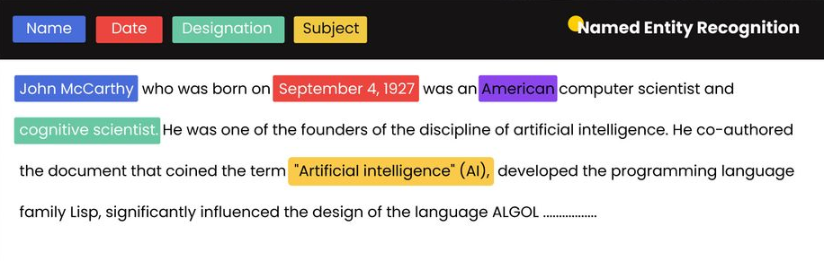{fig-align="center"}

## A Brief History of NER {style="font-size:0.7em"}

-   **Early Contributions**: Lisa Rau’s [-@rau1991extracting] work on extracting company names was pioneering, addressing the challenges posed by unknown words in NLP tasks.

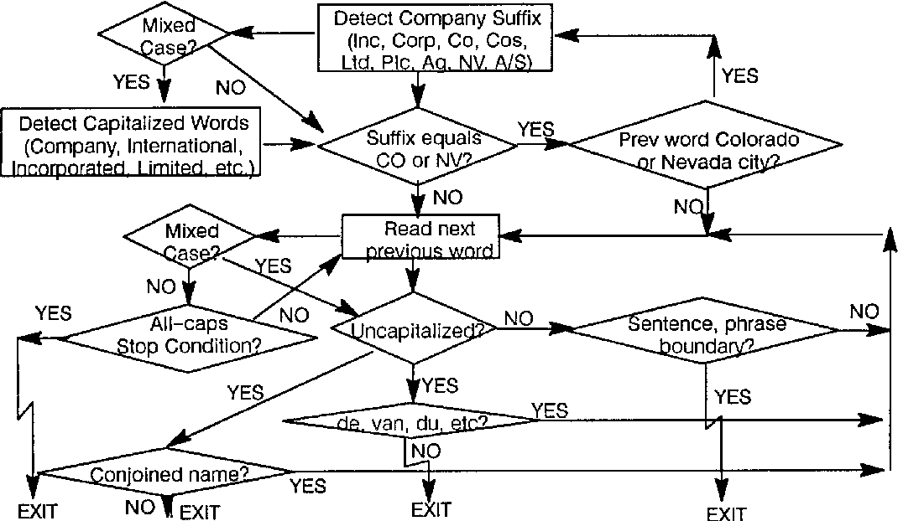{fig-align="center" width="60%"}

-   **Origins**: The term "Named Entity" was formally introduced in the Sixth Message Understanding Conference (MUC-6), where it was recognized as essential for **extracting structured information** [@grishman1996message].

-   **Evolution**: Methods evolved from rule-based approaches to **machine learning** and eventually **deep learning** models [@nadeau2007survey; @liu2022overview].

## Advanced NER: The GliNER Model

-   **G**eneralist and **Li**ghtweight Model for **N**amed **E**ntity **R**ecognition [@zaratianaGLiNERGeneralistModel2024]
-   A modern, zero-shot NER model that can identify any entity type without being explicitly trained on it.

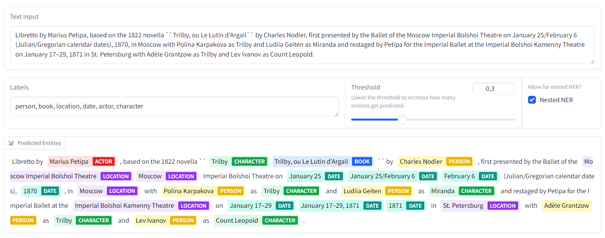{fig-align="center" width="100%"}

## GliNER: Benchmark Performance

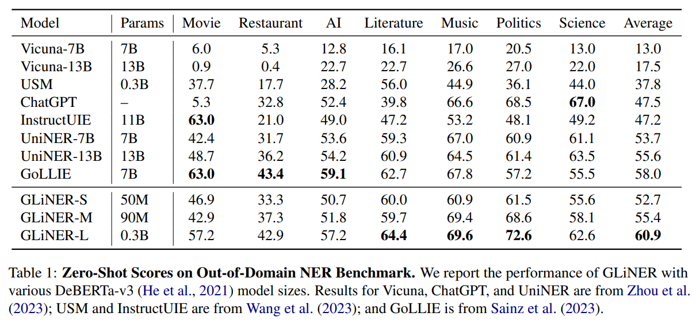

## Fine-tuning a Custom NER Model {style="font-size:0.65em"}

The real power of models like GliNER is the ability to **fine-tune** them for a specific domain.

Let's walk through the process of creating a custom model for detecting COVID-19 vaccine side effects.

### Step 1: Labeling Data

It all starts with high-quality annotated data. Tools like **Label Studio** are industry standard.

``` shell
label-studio start
```

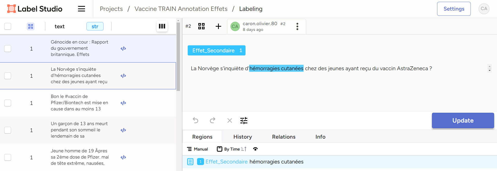

## Finetuning - Upload annotaded data

I used the [GliNER Studio Colab notebook](https://colab.research.google.com/drive/1rPmi_rdvVbVLHkuR56iuZU7YMLFYRGPA) [@stepanov2024gliner] from [Knowledgator](https://www.linkedin.com/company/knowledgator/).


## Finetuning - Train the model

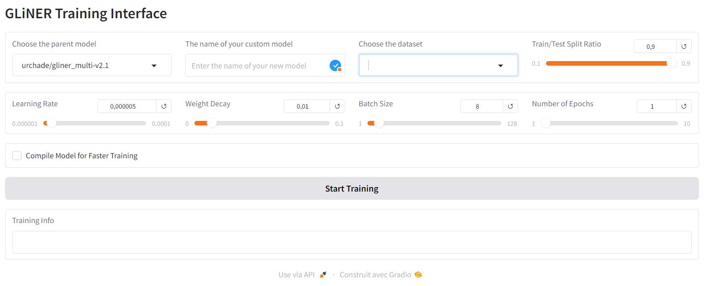

## Finetuning - gliner_multi-v2.1

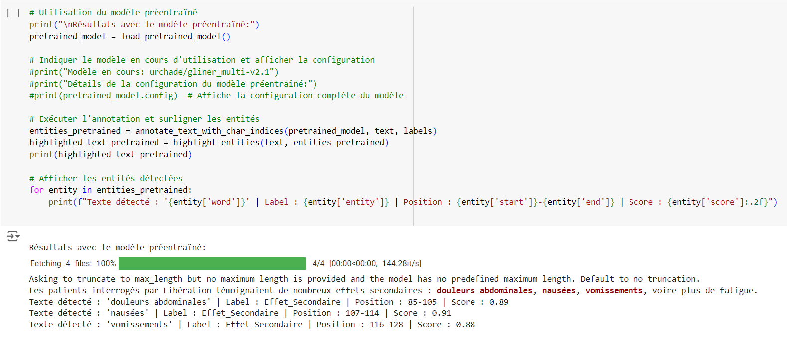

## Finetuning - [Custom model](https://colab.research.google.com/drive/12V3nFQtYHg3NuzK5GQab6HI0LQ8lMeWm#scrollTo=X1qJ0OebJjBk) for Covid-19 vaccines' side effects

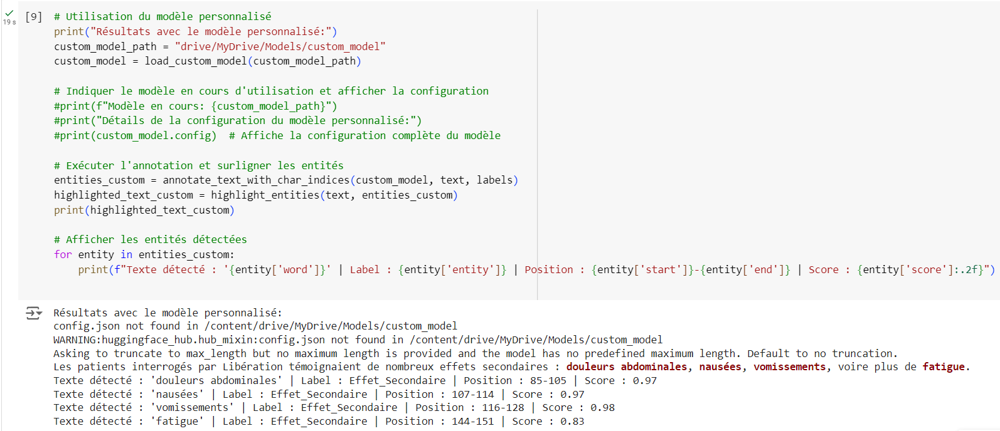

## Pharmaceutical Brands

| **Pfizer** | **AstraZeneca** | **Moderna** | **Sanofi** | **BioNTech** |
|-----------|-----------------|-------------|------------|--------------|
| 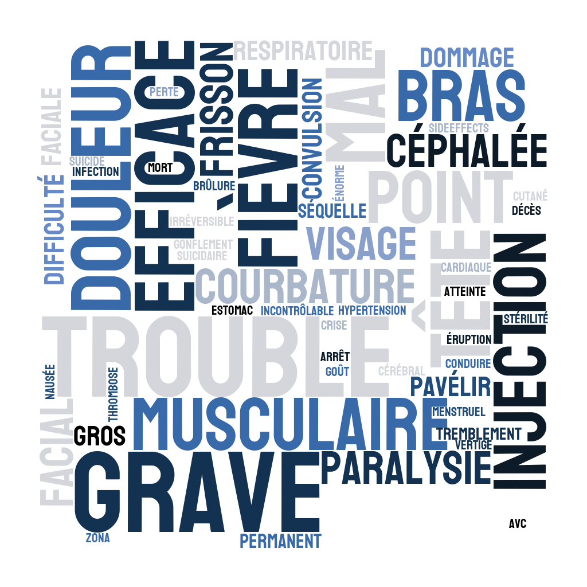{width="180px"} | {width="180px"} | {width="180px"} | 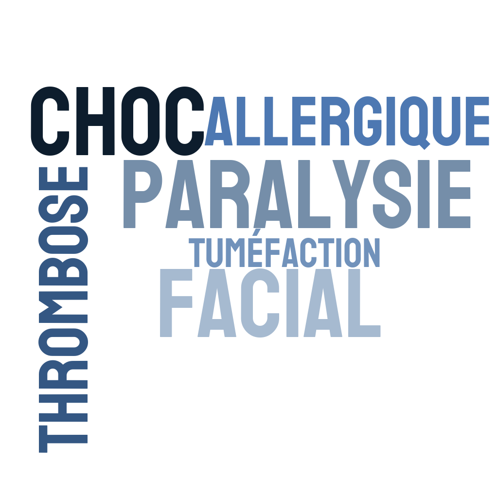{width="180px"} | {width="180px"} |

## Pharmaceutical Companies

| **AstraZeneca** | **BioNTech** |
|-----------------|--------------|
| 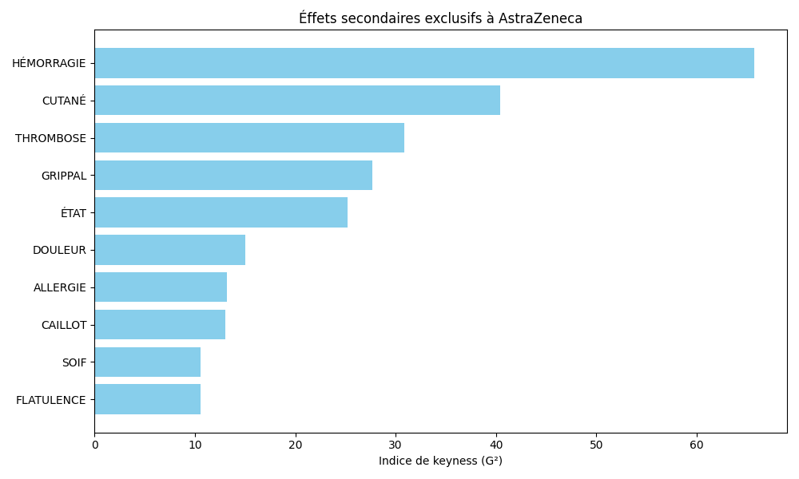{width="450px"} | 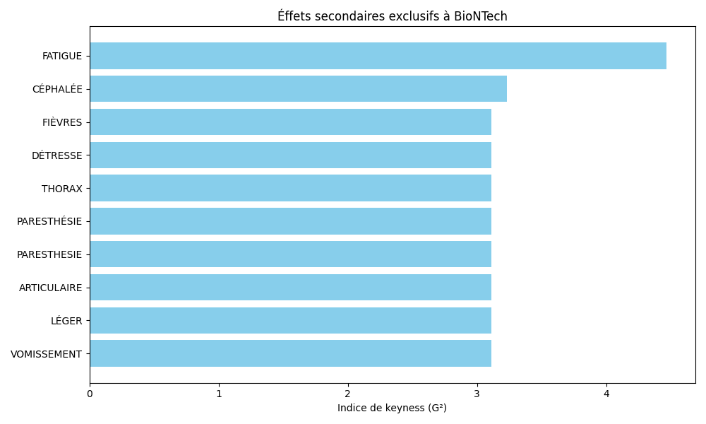{width="450px"} |

| **Moderna** | **Pfizer** |
|-------------|------------|
| 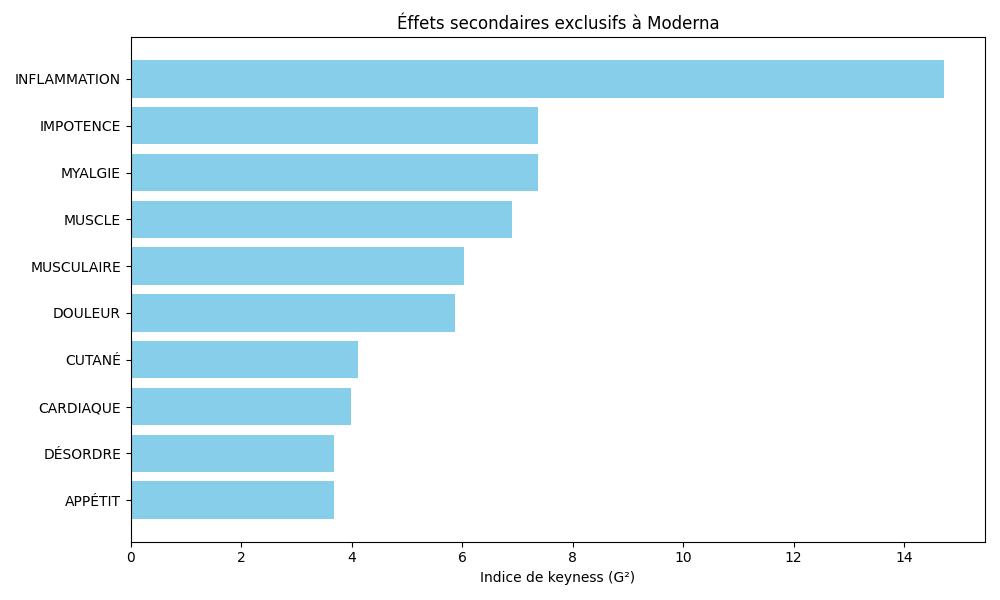{width="450px"} | 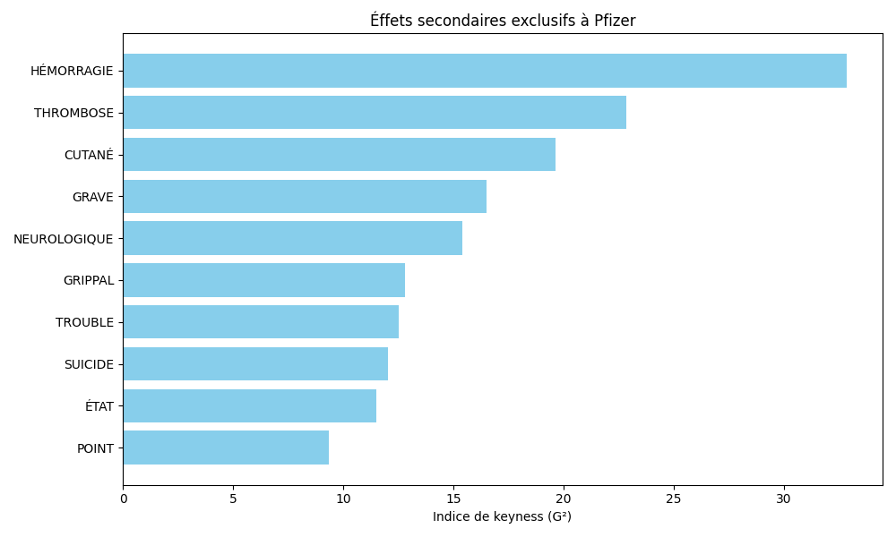{width="450px"} |

## Building an Interactive Demo

To make your model accessible, you can build a simple web app using tools like **Streamlit**.

-   **Live Demo**: <https://huggingface.co/spaces/oliviercaron/GLiNER_file>
-   **Source Code**: <https://github.com/oliviercaron/GliNER_streamlit>
-   **Model on Hugging Face**: <https://huggingface.co/oliviercaron/gliner-fr-adr-twitter>

This allows users to interact with your custom NER model easily.

# Part 2: Text Classification for Public Health {.transition-slide-ubdblue}

## What is #SMM4H-HeaRD? {style="font-size:0.8em"}

**#SMM4H-HeaRD** is a series of scientific competitions (*shared tasks*) in NLP applied to health.

::::: columns
::: {.column width="50%"}
### The Objective

To collaboratively develop and evaluate NLP/AI methods for health research, using data from social media and the web.
:::

::: {.column width="50%"}
### Public Health Relevance

Traditional pharmacovigilance suffers from significant under-reporting.

Social networks (Reddit, X) are a massive, real-time data source for detecting safety signals.
:::
:::::

\
\

::: {.callout-note appearance="simple"}
#### The Stakes

The US CDC encourages the use of this data. #SMM4H-HeaRD is the benchmark workshop for advancing the state of the art.
:::

## Workflow of a 'Shared Task' {style="font-size:0.7em"}

A standardized process for a fair and rigorous comparison of proposed systems.

::::::: columns
::: {.column width="25%"}
### Data

- Organizers provide annotated data (`train`, `valid`).
- Teams register for the tasks.
:::

::: {.column width="25%"}
### Development

- Teams develop and train their models.
- Performance on the `valid` set guides optimizations.
:::

::: {.column width="25%"}
### Evaluation

- An unlabeled test set (`test`) is released.
- Teams have **5 days** to submit their predictions on **CodaLab**.
- CodaLab calculates scores and establishes the final ranking.
:::

::: {.column width="25%"}
### Publication

- Each team submits a paper describing its system on **OpenReview**.
- Peer-reviewed papers are published in the workshop proceedings (here, ICWSM 2025).
:::
:::::::

::: {.callout-tip title="The 2025 Edition in Numbers"}
- **6 tasks**: Varied sources, languages, and topics (adverse events, insomnia...).
- **57 teams** registered, representing **17 countries**.
:::

# The Challenges: Tasks 1 & 6 {.transition-slide-ubdblue style="font-size:0.8em"}

## Task 1: Multilingual Detection of Adverse Drug Events (ADE) {style="font-size:0.9em"}


### Objective

- **Binary classification** of social media posts to detect *Adverse Drug Events* (ADE).
- Label `1`: Personal mention of an ADE.
- Label `0`: No mention.

### Data and Challenges

- **Varied Sources**: X, forums, review sites (RuDReC corpus).
- **Multilingual**: English, French, German, Russian.
- **Extreme Class Imbalance**: Positive class is a very small minority (5.5% to 10.2%).
- **Text Heterogeneity**: Posts in FR/DE are much longer (median > 155 words) than in EN/RU (median < 35 words).


## Task 6: Detection of Vaccine Adverse Event Mentions (VAEM) on Reddit {style="font-size:0.8em"}

::::::: columns
::: {.column width="45%"}
### Objective

- Classify Reddit posts regarding the shingles vaccine.
- Distinguish a **personal experience** of an adverse event (VAEM) from general discussion.
- Label `1`: Personal account of a reaction.
- Label `0`: General discussion, question, etc.

### Data and Challenges

- **Source**: Reddit (English).
- **Distribution**: **Balanced** dataset (positive class ≈46%).
- **Main Challenge**: Understanding context to differentiate personal experience from simple mentions.
:::

::::: {.column width="55%"}
### Concrete Examples

::: {.callout-note appearance="simple"}
#### Positive (Label 1)

"**Shingles Vaccine**: I had my 1st one in December. Felt like I had the flu for a day and a half afterwards."

Personal account ("I had") of a symptom ("flu") linked to the vaccine.
:::

::: {.callout-note appearance="simple"}
#### Negative (Label 0)

"**Should I get Shingrix at 22?**: I didn't need prior auth, just a prescription sent in by my doctor... I spend all day every day calling pharmacies for other people..."

The post talks about the vaccine but does not report any personal reaction.
:::
:::::
:::::::

# Our Approach (ACSS-PSL) {.transition-slide-ubdblue style="font-size:0.8em"}

## Our Strategy for Task 1 (Multilingual) {style="font-size:0.6em"}

Faced with imbalance and multilingualism, we prioritized a robust approach.

:::::: columns
:::: {.column width="50%"}
### Model and Strategy

- **Model**: **XLM-ROBERTa-Large** for its cross-lingual capabilities.
- **Key Strategy**: **Class weighting** (inverse frequency) in the loss function to reinforce the minority class.
- **Preprocessing**: None, we relied on the model's raw capabilities.

::: {.callout-note appearance="simple"}
#### Final Result (Test Set)

Our system achieved a **Global F1-score of 0.633**.
:::
::::

::: {.column width="50%"}
### Training Parameters

- **Optimizer**: AdaFactor
- **Learning rate**: $1 \times 10^{-5}$ (cosine scheduler, 10% warmup)
- **Epochs**: 6 (early stopping on F1, patience 1)
- **Batch size**: 32 (via 16 gradient accumulation steps)
- **Regularization**: Dropout at 0.3
- **Max length**: 256 tokens
- **Precision**: BF16
:::
::::::

## Our Strategy for Task 6 (Monolingual) {style="font-size:0.6em"}

For this balanced task, we opted for a cross-validation and ensembling strategy to maximize robustness.

:::::: columns
:::: {.column width="50%"}
### Model and Strategy

- **Model**: **DeBERTa-V3-Base**, for its excellent performance/size ratio.
- **Key Strategy**:
  1. **Stratified 5-fold Cross-Validation** to train 5 distinct models.
  2. **Ensembling**: Final predictions are obtained by **probability averaging** of the 5 models.

::: {.callout-note appearance="simple"}
#### Final Result (Test Set)

Our system achieved an **F1-score of 0.951**, beating the baseline. Ensembling provided a crucial gain (vs. F1 of 0.942 for the best single model).
:::
::::

::: {.column width="50%"}
### Training and Ensembling Process

- **Optimizer**: AdamW
- **Learning rate**: $2 \times 10^{-5}$
- **Epochs**: 6 per fold (early stopping on F1, patience 3)
- **Batch size**: 8
- **Max length**: 512 tokens
- **Precision**: FP16
- **Decision Threshold**: Optimized at 0.8147 on validation probabilities to maximize the F1-score.
:::
::::::

# Top Performances: Task 1 {.transition-slide-ubdblue style="font-size:0.8em"}

## The Approaches That Made the Difference {style="font-size:0.65em"}

The top two teams achieved nearly identical F1 scores (0.709 and 0.708) using recent LLMs, but with very different improvement strategies.

::::: columns
::: {.column width="50%"}
### 1st: PEI (F1 = 0.709)

- **Model**: **Mistral-Nemo-Instruct-2407**.
- **Key Strategy**: **Iterative and Error-Targeted Data Augmentation**.
- **Loop Process**:
  1. The model is trained initially on the original data.
  2. It is then used to predict labels for this same training data to identify its own errors.
  3. Misclassified examples are **paraphrased by the LLM itself** to create new, semantically identical variants.
  4. These new data points are added to the training set.
  5. The model is **retrained from scratch** on this enriched dataset.
- **Result**: This method, repeated twice, allowed the model to focus on difficult examples and surpass classic approaches.
:::

::: {.column width="50%"}
### 2nd: Y2K (F1 = 0.708)

- **Model**: **Gemma 3**.
- **"MUSIC" Architecture**: A two-step approach with **self-correction**.
  1. A **"Classifier"**: A first LLM that gives an initial label to the post.
  2. A **"Judge"**: A second LLM that examines the first one's decision and **confirms or rejects it**.
- **Training the "Judge"**: The Judge is trained with the help of a more powerful LLM (Claude 3.7) which provides **natural language reasoning** to justify good and bad decisions.
- **Complementary Techniques**:
  - **Data Augmentation** via systematic translation of posts into the other 3 languages.
  - **Ensembling**: The final result is a majority vote between 5 Classifiers and 2 Judges.
:::
:::::

# Top Performances: Task 6 {.transition-slide-ubdblue style="font-size:0.8em"}

## The Approaches That Made the Difference {style="font-size:0.7em"}

For this monolingual and balanced task, the top two teams excelled with radically different strategies: one "classic" but highly optimized, the other based on guided LLM reasoning.

::::: columns
::: {.column width="50%"}
### 1st: BioNLP1 (F1 = 0.959)

- **"Hybrid" Approach**: Combination of traditional and neural features.
- **Two Types of Representations**:
  1. **Lexical Features (TF-IDF)**: To capture the frequency and importance of words and n-grams (up to 5 words).
  2. **Contextual Embeddings**: Semantic representations extracted from a pre-trained **RoBERTa-Large** model, then fine-tuned on the task data.
- **Final Classifier**: Both feature vectors (TF-IDF and RoBERTa) are concatenated ("stacking") and provided as input to a simple yet powerful classifier: a **Support Vector Machine (SVM)**.
- **Result**: This architecture, combining the best of both worlds (lexical and deep semantic), achieved the competition's best score.
:::

::: {.column width="50%"}
### 2nd: GooSeek (F1 = 0.957)

- **Model**: **Llama 3.1-8B-Instruct**.
- **Key Strategy**: **Prompting with "Chain-of-Thought" (CoT)** in *zero-shot* mode.
- **The CoT Prompt**: The LLM is not simply asked to classify, but to follow an **explicit reasoning process in 4 steps** for each post:
  1. Check for indicators of a first-person experience (e.g., "I", "my").
  2. Look for an explicit mention of receiving the vaccine.
  3. Identify the mention of side effects.
  4. Evaluate the context and classify "0" if the language is ambiguous.
- **Result**: Guidance via CoT proved crucial. An ablation study showed that this technique significantly improved performance, much more so than adding examples (*few-shot*).
:::
:::::

## Example of Feature Concatenation (Stacking) {style="font-size:0.5em"}

For a given post, two distinct vector representations are calculated.

::::: columns
::: {.column width="45%"}
### 1. Initial Vectors

#### TF-IDF Vector
(Dimension $d_{tfidf}$)
$$v_{tfidf} = [0.04, 0.50, 0.00, ..., -0.90]$$

#### RoBERTa Embedding Vector
(Dimension $d_{emb}$)
$$v_{emb} = [0.44, 0.45, -0.89, ..., 0.12]$$
:::

::: {.column width="55%"}
### 2. Concatenation

They are then placed end-to-end to form a single large vector (stacking).

#### Final Vector
(Dimension $d_{tfidf} + d_{emb}$)
$$v_{stacked} = [ \underbrace{0.04, 0.50, ..., -0.90}_{v_{tfidf}}, \underbrace{0.44, 0.45, ..., 0.12}_{v_{emb}} ]$$

This final, richer vector is then provided to the SVM classifier.

:::
::::
::: {.callout-note appearance="simple" icon=false}
#### 💡 The RBF Kernel

The trick of the **RBF (Radial Basis Function) Kernel** is to measure the **similarity** between posts. Instead of trying to separate data with a straight "line" in the initial space, it projects them into a higher dimension where they become easier to separate by a "plane".

The equation calculating this similarity is:
$$K(x_i, x_j) = \exp(-\gamma \|x_i - x_j\|^2)$$

- **$K(x_i, x_j)$**: Calculates a **similarity** score between two posts, $x_i$ and $x_j$.
- **$\|x_i - x_j\|^2$**: Measures the squared **distance** between the two vectors. The "closer" they are, the smaller this term is.
- **$\gamma$** (gamma): A parameter that adjusts the **influence** of each point (can be seen as a "zoom").
- **$\exp(...)$**: The exponential function transforms this distance into a similarity score (between 0 and 1). If the distance is zero, similarity is maximal (1).

In short, the SVM uses this measure to create a complex, non-linear decision boundary, which is very effective for this type of data.
:::


# Feedback / Lessons Learned {.transition-slide-ubdblue style="font-size:0.8em"}

## The Crucial Importance of Rigorous Evaluation {style="font-size:0.75em"}

Participating in a *shared task* imposes rigor that goes beyond a simple `train_test_split`.

:::::: columns
::: {.column width="33%"}
### 1. Cross-Validation

- **Lesson**: Essential for datasets of modest size.
- **Benefits**:
  - Uses all data (training & validation).
  - Provides a **more robust** performance estimate.
  - Allows for powerful **ensembling**.
:::

::: {.column width="33%"}
### 2. Threshold Optimization

- **Lesson**: The default threshold (0.5) is rarely optimal for the F1-score.
- **Practice**: One must search for the threshold that maximizes the target metric on the validation set probabilities. This allowed a gain of 0.2 points on Task 1.
:::

::: {.column width="33%"}
### 3. Ablation Studies

- **Discovery**: Removing system components to measure their individual contribution.
- **Example (GooSeek)**: An ablation study proved that *Chain-of-Thought* (CoT) prompting improved performance, justifying their architecture choice.
:::
::::::

## The Participation Process and Tools {style="font-size:0.65em"}

Beyond modeling, a large part of the work is logistical and technical.

:::::: columns
::: {.column width="33%"}
### The Submission Process

1. Receipt of `train` & `valid` data.
2. Receipt of the unlabeled `test` file.
3. Generation of the `predictions.csv` file with our best model.
4. Upload of a `.zip` archive to **CodaLab**.
:::

::: {.column width="33%"}
### Key Platforms

- **CodaLab**: Competition platform for submission and automatic evaluation. The final arbiter.
- **OpenReview**: Platform for paper submission and the peer-review process.
- **GitHub**: Essential for sharing reproducible code.
:::

::: {.column width="33%"}
### Experiment Management

- **Lesson**: It is vital to track every experiment (model, hyperparameters, score).
- **Tools**: A spreadsheet is a good start. Tools like **WandB** (Weights & Biases) allow for professional tracking, comparison, and visualization of results.
:::

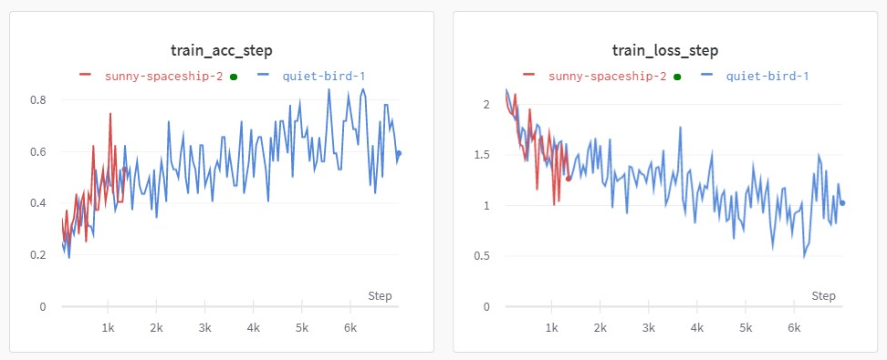{fig-align="right" width="55%"}
::::::

# Conclusion {.transition-slide-ubdblue style="font-size:0.8em"}

## Summary and Next Steps {style="font-size:0.7em"}

::::: columns
::: {.column width="50%"}
### Summary of Our Participation

- **Competitive Results**, with a ranking above the median for both tasks.
- **Task 1 (Multilingual ADE)**: F1 of **0.633**. Honorable, but data heterogeneity and imbalance remain major challenges.
- **Task 6 (Shingles VAEM)**: F1 of **0.951**. A success. Our strategy (DeBERTa + CV/Ensembling) proved very robust on noisy Reddit data.
:::

::: {.column width="50%"}
### Trends and Areas for Improvement

- **General Trend**: **LLMs** are the new norm (used by 18/29 teams).
- **Ideas for Task 1**:
  - Explore **data augmentation** via LLMs.
  - Fine-tune a **recent multilingual LLM** (Mistral, Gemma) with PEFT techniques.
- **Ideas for Task 6**:
  - Test a larger version of the model (**DeBERTa-V3-Large**).
  - Combine our approach with heuristics generated by an LLM.
:::
:::::

# Oxford Workshop: LLMs for Survey Imputation {.transition-slide-ubdblue style="font-size:0.8em"}

## The challenge and data (Oxford, "LLMs for Social Sciences")

\

- **Goal**: predict missing answers to 33 target questions (`t_Q*`) from the WVS survey using the other answers.

\

- **Data**: `train.csv` (5,000 respondents × 266 variables) + `wvs_answer_categories_VERBATIM.json` (question text + allowed labels).

## Feature importance we computed (before ranking) {style="font-size:0.8em"}

- Goal: quantify how predictive each non-target question is for every target (`t_Q*`) before prompting.
- Inputs: full `train.csv` (5,000 respondents, 33 targets) + per-question levels from `wvs_answer_categories_VERBATIM.json` (see `oxford_llms/Sans titre.qmd`).
- Preprocessing (R): normalize tokens, harmonize answer variants (e.g., Strongly agree/Agree strongly), detect Likert/binary vs nominal, and align NA tokens.
- Metrics computed (per target/feature pair):
  - **Mutual Information** (captures non-linear dependence).
  - **Cramer's V** (strength for nominal × ordinal).
  - **Theil's U** (asymmetric association for categorical vars).
- Aggregation: combine the three association metrics into a single standardized `score` per pair (mix of normalized MI, Cramér’s V, Theil’s U), then rank features per target.
- Outputs: `rank_all_questions.csv` (per-target rankings) and `most_popular_questions_features.csv` (cross-target signals).

## Picking the pivot questions (statistical correlation)

- `rank_all_questions.csv` blends **mutual information**, **Theil's U**, and **Cramer's V** into a score for each (target, feature), then ranks the most predictive questions.

| Target `t_Q19` (question: *"Would you prefer not to have people of a different race as neighbors?"*) | MI   | TheilU | CramerV | Score |
|-------------------------------------------------|------|--------|---------|-------|
| **N_REGION_ISO** – region of residence          | 0.135 | 0.294  | 0.515   | 0.268 |
| **Q21** – avoid immigrant neighbors?            | 0.113 | 0.245  | 0.513   | 0.232 |
| **Q23** – avoid neighbors of another religion?  | 0.107 | 0.234  | 0.510   | 0.223 |
| **Q223** – voting intention                     | 0.103 | 0.227  | 0.458   | 0.213 |
| **Q26** – avoid neighbors of another language?  | 0.099 | 0.216  | 0.497   | 0.209 |

## Strongest cross-target features (33 targets) {style="font-size:0.8em"}

| Feature | Role (summary) | Target coverage | Mean rank | Strength score |
|---------|----------------|-----------------|-----------|----------------|
| **N_REGION_ISO** | Current region | 33/33 | 1.3 | 649 |
| **Q223** | Party/political leaning | 33/33 | 3.2 | 588 |
| **Q290** | Ethno/racial identity | 33/33 | 4.5 | 546 |
| **Q267** | Mother’s birth country | 33/33 | 6.0 | 494 |
| **Q268** | Father’s birth country | 33/33 | 6.5 | 478 |
| **Q266** | Respondent birth country | 33/33 | 7.8 | 434 |
| **Q272** | Language spoken at home | 33/33 | 9.3 | 387 |
| **B_COUNTRY** | Country of residence | 33/33 | 9.9 | 365 |

## Concrete example: prompt inputs (top 10 by score) {style="font-size:0.8em"}

- Respondent **528070145** (train.csv) for target `t_Q19`; features are the **top 10** for this target in `rank_all_questions.csv`.

| Key feature | Provided answer |
|-------------|-----------------|
| Region (N_REGION_ISO) | Overijssel |
| Immigrant neighbors? (Q21) | No answer |
| Neighbors of another religion? (Q23) | No answer |
| Party/affinity (Q223) | No answer |
| Neighbors of another language? (Q26) | No answer |
| Racial identity (Q290) | Don't know |
| Birth country (Q266) | Netherlands |
| Father born where? (Q268) | Netherlands |
| Mother born where? (Q267) | Netherlands |
| Country of residence (B_COUNTRY) | Netherlands |

## Full persona text (same respondent, `t_Q19`) {style="font-size:1.2em"}

::: {.callout-note appearance="simple" icon=false}
The respondent currently resides in Overijssel, Netherlands, and was born in the Netherlands, as were both of their parents. However, the respondent did not provide answers to several questions regarding their preferences about neighbors of different backgrounds, including immigrants, people of different religions, and those who speak different languages. Additionally, they did not indicate their voting preferences for a national election or express their identification regarding racial belonging or ethnic group. This lack of information suggests a reluctance or uncertainty in discussing these topics, which limits the ability to form a comprehensive profile of their views and beliefs.
:::

## Full prompt (persona + target) {style="font-size:0.5em"}

```{.scrollable style="max-height:700px; font-size:1.5em"}
--- SYSTEM (Persona) ---
You are an expert behavioral analyst. Your task is to write a concise, narrative description of a survey respondent based ONLY on the provided answers.

CRITICAL RULES:
1.  **Stick to the Facts**: Base your description ONLY on the provided Question/Answer pairs. Do not invent information.
2.  **Handle Missing Data**: If answers are vague or non-committal (e.g., 'No answer', 'Don't know'), state this limitation directly in your analysis. Do NOT make strong inferences from missing data.
3.  **Format**: Write a single, fluid paragraph of 100-150 words. The output must be plain text, with no Markdown, headers, lists, or bolding.
4.  **No Filler**: Do NOT add any conversational remarks, disclaimers, or hashtags. Your entire output must be the analysis paragraph itself.

--- USER (Persona) ---
Create a detailed profile for the respondent based on the following survey answers:

Question: Which region do you currently live in?
Answer: Overijssel

Question: Would you prefer not to have immigrants/foreign workers as neighbors?
Answer: No answer

Question: Would you prefer not to have people of a different religion as neighbors?
Answer: No answer

Question: If there were a national election tomorrow, for which party would you vote?. If you do not know, which party appeals to you most?
Answer: No answer

Question: Would you prefer not to have people who speak a different language as neighbors?
Answer: No answer

Question: How do you identify when it comes to Racial belonging/ ethnic group in your country?
Answer: Don't know

Question: In which country were you born?
Answer: Netherlands

Question: In which country was your father born? List of codes in Annex
Answer: Netherlands

Question: In which country was your mother born?
Answer: Netherlands

Question: Which country are you currently living in?
Answer: Netherlands

--- GENERATED PERSONA (Example) ---
The respondent currently resides in Overijssel, Netherlands, and was born in the Netherlands, as were both of their parents. However, the respondent did not provide answers to several questions regarding their preferences about neighbors of different backgrounds, including immigrants, people of different religions, and those who speak different languages. Additionally, they did not indicate their voting preferences for a national election or express their identification regarding racial belonging or ethnic group. This lack of information suggests a reluctance or uncertainty in discussing these topics, which limits the ability to form a comprehensive profile of their views and beliefs.

--- SYSTEM (Target) ---
You are an expert in social sciences. Your task is to predict a respondent's answer to a survey question based on their detailed profile and relevant examples.
STRICT OUTPUT RULES:
- Choose EXACTLY ONE option from the provided list.
- Output ONLY the selected option, VERBATIM, with no explanation or punctuation.

--- USER (Target) ---
Persona Profile:
The respondent currently resides in Overijssel, Netherlands, and was born in the Netherlands, as were both of their parents. However, the respondent did not provide answers to several questions regarding their preferences about neighbors of different backgrounds, including immigrants, people of different religions, and those who speak different languages. Additionally, they did not indicate their voting preferences for a national election or express their identification regarding racial belonging or ethnic group. This lack of information suggests a reluctance or uncertainty in discussing these topics, which limits the ability to form a comprehensive profile of their views and beliefs.

Target Question:
Would you prefer not to have people of a different race as neighbors?

Options:
- No answer
- No
- Yes
- Missing
- Don´t know

Your Prediction:
```

## How the few-shot example is inserted (real data) {style="font-size:0.5em"}

- One-hot the top-20 ranked features for `t_Q19`, compute Euclidean distance, pick the nearest neighbor with a known label.
- Example: respondent **528070145** (to predict) vs nearest neighbors (distance 5/10 features; all have `t_Q19 = No`).

| Feature | 528070145 (to predict) | 528070507 | 528071611 | 528070109 |
|---------|-----------------------|------------|------------|------------|
| N_REGION_ISO | Overijssel | Overijssel | Overijssel | Overijssel |
| Q21 – immigrant neighbors? | No answer | No | No | Yes |
| Q23 – different religion neighbors? | No answer | No | No | Yes |
| Q223 – party preference | No answer | NLD: Party for Freedom | NLD: Volt Europe | NLD: Party for Freedom |
| Q26 – different language neighbors? | No answer | No | No | Yes |
| Q290 – racial belonging | Don't know | NL: Caucasian white | NL: Caucasian white | NL: Caucasian white |
| Q266 – birth country | Netherlands | Netherlands | Netherlands | Netherlands |
| Q268 – father's birth country | Netherlands | Netherlands | Netherlands | Netherlands |
| Q267 – mother's birth country | Netherlands | Netherlands | Netherlands | Netherlands |
| B_COUNTRY – current country | Netherlands | Netherlands | Netherlands | Netherlands |
| t_Q19 (target label) | *unknown* | **No** | **No** | **No** |

## The neighbor is injected into the target prompt as:

``` text
Exemple de cas similaire:
---
Profile (top features):
Question: Which region do you currently live in?
Answer: Overijssel
Question: Would you prefer not to have immigrants/foreign workers as neighbors?
Answer: No
Question: Would you prefer not to have people of a different religion as neighbors?
Answer: No
Question: If there were a national election tomorrow, for which party would you vote?. If you do not know, which party appeals to you most?
Answer: NLD: Party for Freedom
Question: Would you prefer not to have people who speak a different language as neighbors?
Answer: No
Question: How do you identify when it comes to Racial belonging/ ethnic group in your country?
Answer: NL: Caucasian white

Target Question:
Would you prefer not to have people of a different race as neighbors?

Known answer: No
---
```

## Prompting pipeline (persona + few-shot) {style="font-size:1em"}

- **1. Select** `TOP_K_FEATURES` (by score) for each target → smaller context, less noise.
- **2. Persona**: system prompt "behavioral analyst" + user prompt listing `Question/Answer` → factual 100–150 word paragraph.
- **3. Few-shot**: one-hot encode selected features, Euclidean distance to find 1 similar respondent → prepend to the target prompt as “Exemple de cas similaire” (profile Q/A + known target).
- **4. Target prompt**: persona + example(s) + **allowed options** (e.g., `t_Q19`: `No answer`, `No`, `Yes`, `Missing`, `Don’t know`) → single choice, validated against the list.
- **5. Fallback**: normalize output (strip quotes, *closest match*) to stay within allowed labels.


## References
